# 原子操作

文章来源*http://www.wowotech.net/linux_kenrel/atomic.html*

## 一、源由

我们的程序逻辑经常遇到这样的操作序列：

1. 读一个位于memory中的变量的值到寄存器中
2. 修改该变量的值*（也就是修改寄存器中的值）*
3. 将寄存器中的数值写回memory中的变量值

如果这个操作序列是串行化的操作*（在一个thread中串行执行）*，那么一切OK，然而，世界总是不能如你所愿。在多CPU体系结构中，运行在两个CPU上的两个内核控制路径同时并行执行上面操作序列，有可能发生下面的场景：

```mermaid
gantt
    title 多CPU控制路径
    dateFormat x
    axisFormat %L
    section CPU1
    读操作 :a1, 0, 3
    修改 :crit, active, a2, 4, 7
    写操作 :a3, 8, 11
    
    section CPU2
    读操作 :b1, 3, 5
    修改 :crit, active, b2, 6, 8
    写操作 :b3, 11, 14
```



多个CPU和memory chip是通过总线互联的，在任意时刻，只能有一个总线master设备*（例如CPU、DMA controller）*访问该Slave设备*（在这个场景中，slave设备是RAM chip）*。因此，来自两个CPU上的读memory操作被串行化执行，分别获得了同样的旧值。完成修改后，两个CPU都想进行写操作，把修改的值写回到memory。但是，硬件arbiter的限制使得CPU的写回必须是串行化的，因此CPU1首先获得了访问权，进行写回动作，随后，CPU2完成写回动作。在这种情况下，CPU1的对memory的修改被CPU2的操作覆盖了，因此执行结果是错误的。

不仅是多CPU，在单CPU上也会由于有多个内核控制路径的交错而导致上面描述的错误。一个具体的例子如下：

```mermaid
gantt
	title 单CPU控制路径
    dateFormat x
    axisFormat %L
    section 系统调用
    读操作 :a1, 0, 0.003s
    修改 :crit, active, a2, 11, 0.002s
    写操作 :a3, after a2, 0.003s
    
    section 中断handler
    读操作 :b1, after a1, 0.003s
    修改 :crit, active, b2, after b1, 0.002s
    写操作 :b3, after b2, 0.003s
```



系统调用的控制路径上，完成读操作后，硬件触发中断，开始执行中断handler。这种场景下，中断handler控制路径的写回的操作被系统调用控制路径上的写回覆盖了，结果也是错误的。

 

## 二、对策

对于那些有多个内核控制路径进行read-modify-write的变量，内核提供了一个特殊的类型atomic_t，具体定义如下：

```c
typedef struct {
    int counter;
} atomic_t;
```


从上面的定义来看，atomic_t实际上就是一个int类型的counter，不过定义这样特殊的类型atomic_t是有其思考的：内核定义了若干atomic_xxx的接口API函数，这些函数只会接收atomic_t类型的参数。这样可以确保atomic_xxx的接口函数只会操作atomic_t类型的数据。同样的，如果你定义了atomic_t类型的变量*（你期望用atomic_xxx的接口API函数操作它）*，这些变量也不会被那些普通的、非原子变量操作的API函数接受。

具体的接口API函数整理如下：

| 接口函数                                                     | 描述                                                         |
| ------------------------------------------------------------ | ------------------------------------------------------------ |
| `static inline void atomic_add(int i, atomic_t *v)`          | 给一个原子变量v增加i                                         |
| `static inline int atomic_add_return(int i, atomic_t *v)`    | 同上，只不过将变量v的最新值返回                              |
| `static inline void atomic_sub(int i, atomic_t *v)`          | 给一个原子变量v减去i                                         |
| `static inline int atomic_sub_return(int i, atomic_t *v)`    | 同上，只不过将变量v的最新值返回                              |
| `static inline int atomic_cmpxchg(atomic_t *ptr, int old, int new)` | 比较old和原子变量ptr中的值，如果相等，<br>那么就把new值赋给原子变量。<br>返回旧的原子变量ptr中的值 |
| `atomic_read`                                                | 获取原子变量的值                                             |
| `atomic_set`                                                 | 设定原子变量的值                                             |
| `atomic_inc(v)`                                              | 原子变量的值加一                                             |
| `atomic_inc_return(v)`                                       | 同上，只不过将变量v的最新值返回                              |
| `atomic_dec(v)`                                              | 原子变量的值减去一                                           |
| `atomic_dec_return(v)`                                       | 同上，只不过将变量v的最新值返回                              |
| `atomic_sub_and_test(i, v)`                                  | 给一个原子变量v减去i，并判断变量v的最新值是否等于0           |
| `atomic_add_negative(i,v)`                                   | 给一个原子变量v增加i，并判断变量v的最新值是否是负数          |
| `static inline int atomic_add_unless(atomic_t *v, int a, int u)` | 只要原子变量v不等于u，那么就执行原子变量v加a的操作。 <br>如果v不等于u，返回非0值，否则返回0值 |

## 三、ARM中的实现

我们以atomic_add为例，描述linux kernel中原子操作的具体代码实现细节：


```c
#if __LINUX_ARM_ARCH__ >= 6 		－－－－－－－－－－－－－－－－－－（1）
static inline void atomic_add(int i, atomic_t *v)
{
   unsigned long tmp;
   int result;

   prefetchw(&v->counter); 			－－－－－－－－－－－－－－－－－－（2）
   __asm__ __volatile__(
       "@ atomic_add\n" 			－－－－－－－－－－－－－－－－－－（3）
       "1:  ldrex  %0, [%3]\n" 		－－－－－－－－－－－－－－－－－－（4）
       "  add  %0, %0, %4\n" 		－－－－－－－－－－－－－－－－－－（5）
       "  strex  %1, %0, [%3]\n" 	－－－－－－－－－－－－－－－－－－（6）
       "  teq  %1, #0\n" 			－－－－－－－－－－－－－－－－－－（7）
       "  bne  1b"
       : "=&r" (result), "=&r" (tmp), "+Qo" (v->counter) －－－对应％0，％1，％2
       : "r" (&v->counter), "Ir" (i) －－－－－－－－－－－－－对应％3，％4
       : "cc");
}
#else
#ifdef CONFIG_SMP
#error SMP not supported on pre-ARMv6 CPUs
#endif
static inline int atomic_add_return(int i, atomic_t *v)
{
   unsigned long flags;
   int val;

   raw_local_irq_save(flags);
   val = v->counter;
   v->counter = val += i;
   raw_local_irq_restore(flags);

   return val;
 }
#define atomic_add(i, v)  (void) atomic_add_return(i, v)
#endif
```

1. ARMv6之前的CPU并不支持SMP，之后的ARM架构都是支持SMP的*（例如我们熟悉的ARMv7-A）*。因此，对于ARM处理，其原子操作分成了两个阵营，一个是支持SMP的ARMv6之后的CPU，另外一个就是ARMv6之前的，只有单核架构的CPU。对于UP，原子操作就是通过关闭CPU中断来完成的。

2. 这里的代码和preloading cache相关。在strex指令之前将要操作的memory内容加载到cache中可以显著提高性能。

3. 为了完整性，我还是重复一下汇编嵌入c代码的语法：嵌入式汇编的语法格式是：asm(code : output operand list : input operand list : clobber list)。output operand list 和 input operand list是c代码和嵌入式汇编代码的接口，clobber list描述了汇编代码对寄存器的修改情况。为何要有clober list？我们的c代码是gcc来处理的，当遇到嵌入汇编代码的时候，gcc会将这些嵌入式汇编的文本送给gas进行后续处理。这样，gcc需要了解嵌入汇编代码对寄存器的修改情况，否则有可能会造成大麻烦。例如：gcc对c代码进行处理，将某些变量值保存在寄存器中，如果嵌入汇编修改了该寄存器的值，又没有通知gcc的话，那么，gcc会以为寄存器中仍然保存了之前的变量值，因此不会重新加载该变量到寄存器，而是直接使用这个被嵌入式汇编修改的寄存器，这时候，我们唯一能做的就是静静的等待程序的崩溃。还好，在output operand list 和 input operand list中涉及的寄存器都不需要体现在clobber list中（gcc分配了这些寄存器，当然知道嵌入汇编代码会修改其内容），因此，大部分的嵌入式汇编的clobber list都是空的，或者只有一个cc，通知gcc，嵌入式汇编代码更新了condition code register。

   大家对着上面的code就可以分开各段内容了。@符号标识该行是注释。

   这里的\_\_volatile\_\_主要是用来防止编译器优化的。也就是说，在编译该c代码的时候，如果使用优化选项（-O）进行编译，对于那些没有声明\_\_volatile\_\_的嵌入式汇编，编译器有可能会对嵌入c代码的汇编进行优化，编译的结果可能不是原来你撰写的汇编代码，但是如果你的嵌入式汇编使用\_\_asm\_\_    \_\_volatile\_\_(嵌入式汇编)的语法格式，那么也就是告诉编译器，不要随便动我的嵌入汇编代码哦。


4. 我们先看ldrex和strex这两条汇编指令的使用方法。ldr和str这两条指令大家都是非常的熟悉了，后缀的ex表示Exclusive，是ARMv7提供的为了实现同步的汇编指令。
    ```assembly
    LDREX <Rt>, [<Rn>]
    ```

    <Rn>是base register，保存memory的address，LDREX指令从base register中获取memory address，并且将memory的内容加载到<Rt> *(destination register)*中。这些操作和ldr的操作是一样的，那么如何体现exclusive呢？其实，在执行这条指令的时候，还放出两条“狗”来负责观察特定地址的访问*（就是保存在[<Rn>]中的地址了）*，这两条狗一条叫做local monitor，一条叫做global monitor。

    ```assembly
    STREX <Rd>, <Rt>, [<Rn>]
    ```

    和LDREX指令类似，<Rn>是base register，保存memory的address，STREX指令从base register中获取memory address，并且将<Rt> *(source register)* 中的内容加载到该memory中。这里的<Rd>保存了memeory 更新成功或者失败的结果，0表示memory更新成功，1表示失败。STREX指令是否能成功执行是和local monitor和global monitor的状态相关的。对于Non-shareable memory *（该memory不是多个CPU之间共享的，只会被一个CPU访问）*，只需要放出该CPU的local monitor这条狗就OK了，下面的表格可以描述这种情况

    | thread 1 | thread 2 | local monitor的状态                                          |
    | -------- | -------- | ------------------------------------------------------------ |
    |          |          | Open Access state                                            |
    | LDREX    |          | Exclusive Access state                                       |
    |          | LDREX    | Exclusive Access state                                       |
    |          | Modify   | Exclusive Access state                                       |
    |          | STREX    | Open Access state                                            |
    | Modify   |          | Open Access state                                            |
    | STREX    |          | 在Open Access state的状态下，执行STREX指令会导致该指令执行失败 |
    |          |          | 保持Open Access state，直到下一个LDREX指令                   |

    开始的时候，local monitor处于Open Access state的状态，thread 1执行LDREX 命令后，local monitor的状态迁移到Exclusive Access state*（标记本地CPU对xxx地址进行了LDREX的操作）*，这时候，中断发生了，在中断handler中，又一次执行了LDREX ，这时候，local monitor的状态保持不变，直到STREX指令成功执行，local monitor的状态迁移到Open Access state的状态*（清除xxx地址上的LDREX的标记）*。返回thread 1的时候，在Open Access state的状态下，执行STREX指令会导致该指令执行失败*（没有LDREX的标记，何来STREX）*，说明有其他的内核控制路径插入了。

    对于shareable memory，需要系统中所有的local monitor和global monitor共同工作，完成exclusive access，概念类似，这里就不再赘述了。

    大概的原理已经描述完毕，下面回到具体实现面。
    ```c
    "1:  ldrex  %0, [%3]\n"
    ```
    其中％3就是input operand list中的"r" (&v->counter)，r是限制符（constraint），用来告诉编译器gcc，你看着办吧，你帮我选择一个通用寄存器保存该操作数吧。％0对应output openrand list中的"=&r" (result)，=表示该操作数是write only的，&表示该操作数是一个earlyclobber operand，具体是什么意思呢？编译器在处理嵌入式汇编的时候，倾向使用尽可能少的寄存器，如果output operand没有&修饰的话，汇编指令中的input和output操作数会使用同样一个寄存器。因此，&确保了％3和％0使用不同的寄存器。
    
5. 完成步骤4后，％0这个output操作数已经被赋值为atomic_t变量的old value，毫无疑问，这里的操作是要给old value加上i。这里％4对应"Ir" (i)，这里“I”这个限制符对应ARM平台，表示这是一个有特定限制的立即数，该数必须是0～255之间的一个整数通过rotation的操作得到的一个32bit的立即数。这是和ARM的data-processing instructions如何解析立即数有关的。每个指令32个bit，其中12个bit被用来表示立即数，其中8个bit是真正的数据，4个bit用来表示如何rotation。更详细的内容请参考ARM ARM文档。

6. 这一步将修改后的new value保存在atomic_t变量中。是否能够正确的操作的状态标记保存在％1操作数中，也就是"=&r" (tmp)。

7. 检查memory update的操作是否正确完成，如果OK，皆大欢喜，如果发生了问题*（有其他的内核路径插入）*，那么需要跳转到lable 1那里，从新进行一次read-modify-write的操作。
