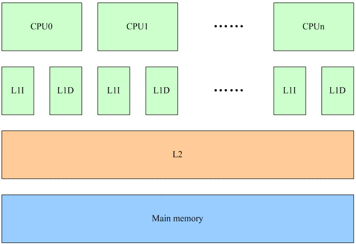
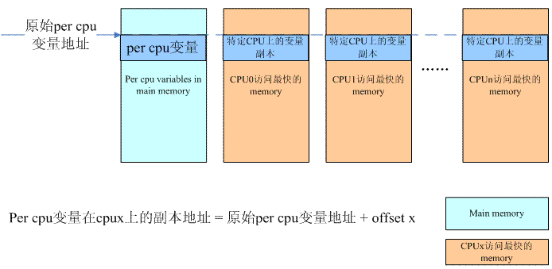

# Per-CPU变量

文章来源http://www.wowotech.net/linux_kenrel/per-cpu.html

## 一、源由

为何引入Per-CPU变量？

### lock bus带来的性能问题

在ARM平台上，ARMv6之前，SWP和SWPB指令被用来支持对shared memory的访问：

```assembly
SWP <Rt>, <Rt2>, [<Rn>]
```

`Rn`中保存了SWP指令要操作的内存地址，通过该指令可以将`Rn`指定的内存数据加载到`Rt`寄存器，同时将`Rt2`寄存器中的数值保存到`Rn`指定的内存中去。

我们在[原子操作](1-原子操作.md)那篇文档中描述的read-modify-write的问题本质上是一个保持对内存read和write访问的原子性的问题。也就是说对内存的读和写的访问不能被打断。对该问题的解决可以通过硬件、软件或者软硬件结合的方法来进行。早期的ARM CPU给出的方案就是依赖硬件：SWP这个汇编指令执行了一次读内存操作、一次写内存操作，但是从程序员的角度看，SWP这条指令就是原子的，读写之间不会被任何的异步事件打断。具体底层的硬件是如何做的呢？这时候，硬件会提供一个lock signal，在进行memory操作的时候设定lock信号，告诉总线这是一个不可被中断的内存访问，直到完成了SWP需要进行的两次内存访问之后再clear lock信号。 

lock memory bus对多核系统的性能造成严重的影响 *（系统中其他的processor对那条被lock的memory bus的访问就被hold住了）* ，如何解决这个问题？最好的锁机制就是不使用锁，因此解决这个问题可以使用釜底抽薪的方法，那就是不在系统中的多个processor之间共享数据，给每一个CPU分配一个不就OK了吗。

当然，随着技术的发展，在ARMv6之后的ARM CPU已经不推荐使用`SWP`这样的指令，而是提供了`LDREX`和`STREX`这样的指令。这种方法是使用软硬件结合的方法来解决原子操作问题，看起来代码比较复杂，但是系统的性能可以得到提升。其实，从硬件角度看，`LDREX`和`STREX`这样的指令也是采用了lock-free的做法。OK，由于不再lock bus，看起来Per-CPU变量存在的基础被打破了。不过考虑cache的操作，实际上它还是有意义的。

### cache的影响

在[The Memory Hierarchy](http://www.wowotech.net/basic_subject/memory-hierarchy.html)文档中，我们已经了解了关于memory一些基础的知识，一些基础的内容，这里就不再重复了。我们假设一个多核系统中的cache如下：



每个CPU都有自己的L1 cache *（包括data cache和instruction cache）* ，所有的CPU共用一个L2 cache。L1、L2以及main memory的访问速度之间的差异都是非常大，最高的性能的情况下当然是L1 cache hit，这样就不需要访问下一阶memory来加载cache line。

我们首先看在多个CPU之间共享内存的情况。这种情况下，任何一个CPU如果修改了共享内存就会导致所有其他CPU的L1 cache上对应的cache line变成invalid *（硬件完成）* 。虽然对性能造成影响，但是系统必须这么做，因为需要维持cache的同步。将一个共享memory变成Per-CPU memory本质上是一个耗费更多memory来解决performance的方法。当一个在多个CPU之间共享的变量变成每个CPU都有属于自己的一个私有的变量的时候，我们就不必考虑来自多个CPU上的并发，仅仅考虑本CPU上的并发就OK了。当然，还有一点要注意，那就是在访问Per-CPU变量的时候，不能调度，当然更准确的说法是该task不能调度到其他CPU上去。目前的内核的做法是在访问Per-CPU变量的时候disable preemptive，虽然没有能够完全避免使用锁的机制 *（disable preemptive也是一种锁的机制）* ，但毫无疑问，这是一种代价比较小的锁。

## 二、接口

### 静态声明和定义Per-CPU变量的API如下表所示：

| 声明和定义Per-CPU变量的API                                   | 描述                                                         |
| ------------------------------------------------------------ | ------------------------------------------------------------ |
| `DECLARE_PER_CPU(type, name)` `DEFINE_PER_CPU(type, name)`   | 普通的、没有特殊要求的per cpu变量定义接口函数。没有对齐的要求 |
| `DECLARE_PER_CPU_FIRST(type, name)` `DEFINE_PER_CPU_FIRST(type, name)` | 通过该API定义的per cpu变量位于整个per cpu相关section的最前面。 |
| `DECLARE_PER_CPU_SHARED_ALIGNED(type, name) DEFINE_PER_CPU_SHARED_ALIGNED(type, name)` | 通过该API定义的per cpu变量在SMP的情况下会对齐到L1 cache line ，对于UP，不需要对齐到cachine line |
| `DECLARE_PER_CPU_ALIGNED(type, name)` `DEFINE_PER_CPU_ALIGNED(type, name)` | 无论SMP或者UP，都是需要对齐到L1 cache line                   |
| `DECLARE_PER_CPU_PAGE_ALIGNED(type, name)` `DEFINE_PER_CPU_PAGE_ALIGNED(type, name)` | 为定义page aligned per cpu变量而设定的API接口                |
| `DECLARE_PER_CPU_READ_MOSTLY(type, name)`     `DEFINE_PER_CPU_READ_MOSTLY(type, name)` | 通过该API定义的per cpu变量是read mostly的                    |

 看到这样“丰富多彩”的Per-CPU变量的API，你是不是已经醉了。这些定义使用在不同的场合，主要的factor包括：

－该变量在section中的位置

－该变量的对齐方式

－该变量对SMP和UP的处理不同

－访问per cpu的形态

例如：如果你准备定义的per cpu变量是要求按照page对齐的，那么在定义该per cpu变量的时候需要使用`DECLARE_PER_CPU_PAGE_ALIGNED`。如果只要求在SMP的情况下对齐到cache line，那么使用`DECLARE_PER_CPU_SHARED_ALIGNED`来定义该per cpu变量。

### 访问静态声明和定义Per-CPU变量的API

静态定义的per cpu变量不能象普通变量那样进行访问，需要使用特定的接口函数，具体如下：

```c
get_cpu_var(var);
put_cpu_var(var);
```

上面这两个接口函数已经内嵌了锁的机制 *（preempt disable）* ，用户可以直接调用该接口进行本CPU上该变量副本的访问。如果用户确认当前的执行环境已经是preempt disable *（例如持有spinlock）* ，那么可以使用lock-free版本的Per-CPU变量的API:

```c
__get_cpu_var
```

### 动态分配Per-CPU变量的API如下表所示：

| 动态分配和释放Per-CPU变量的API         | 描述                                                         |
| -------------------------------------- | ------------------------------------------------------------ |
| `alloc_percpu(type)`                   | 分配类型是type的per cpu变量，返回per cpu变量的地址 *（注意：不是各个CPU上的副本）*  |
| `void free_percpu(void __percpu *ptr)` | 释放ptr指向的per cpu变量空间                                 |

### 访问动态分配Per-CPU变量的API如下表所示：

| 访问Per-CPU变量的API    | 描述                                                         |
| ----------------------- | ------------------------------------------------------------ |
| `get_cpu_ptr`           | 这个接口是和访问静态Per-CPU变量的`get_cpu_var`接口是类似的，当然，这个接口是for 动态分配Per-CPU变量 |
| `put_cpu_ptr`           | 同上                                                         |
| `per_cpu_ptr(ptr, cpu)` | 根据per cpu变量的地址和cpu number，返回指定CPU number上该per cpu变量的地址 |

## 三、实现

### 静态Per-CPU变量定义

我们以DEFINE_PER_CPU的实现为例子，描述linux kernel中如何实现静态Per-CPU变量定义。具体代码如下：

```c
#define DEFINE_PER_CPU(type, name)          \
    DEFINE_PER_CPU_SECTION(type, name, "")
```
`type`就是变量的类型，`name`是per cpu变量符号。`DEFINE_PER_CPU_SECTION`宏可以把一个per cpu变量放到指定的section中，具体代码如下：

```c
#define DEFINE_PER_CPU_SECTION(type, name, sec)        \
    __PCPU_ATTRS(sec) PER_CPU_DEF_ATTRIBUTES      \－－－－－安排section
    __typeof__(type) name－－－－－－－－－－－－－－－－－－－－－－定义变量
```

在这里具体arch specific的percpu代码中 *（arch/arm/include/asm/percpu.h）* 可以定义`PER_CPU_DEF_ATTRIBUTES`，以便控制该per cpu变量的属性，当然，如果arch specific的percpu代码不定义，那么在general arch-independent的代码中 *（include/asm-generic/percpu.h）* 会定义为空。这里可以顺便提一下Per-CPU变量的软件层次：

1. **arch-independent interface** 在include/linux/percpu.h文件中，定义了内核其他模块要使用per cpu机制使用的接口API以及相关数据结构的定义。内核其他模块需要使用per cpu变量接口的时候需要include该头文件

2. **arch-general interface** 在include/asm-generic/percpu.h文件中。如果所有的arch相关的定义都是一样的，那么就把它抽取出来，放到asm-generic目录下。毫无疑问，这个文件定义的接口和数据结构是硬件相关的，只不过软件抽象各个arch-specific的内容，形成一个arch general layer。一般来说，我们不需要直接include该头文件，include/linux/percpu.h会include该头文件。

3. **arch-specific** 这是和硬件相关的接口，在arch/arm/include/asm/percpu.h，定义了ARM平台中，具体和per cpu相关的接口代码。

我们回到正题，看看`__PCPU_ATTRS`的定义：
```c
#define __PCPU_ATTRS(sec)            \
    __percpu __attribute__((section(PER_CPU_BASE_SECTION sec)))  \
    PER_CPU_ATTRIBUTES
```
`PER_CPU_BASE_SECTION` 定义了基础的section name symbol，定义如下：

```c
#ifndef PER_CPU_BASE_SECTION
    #ifdef CONFIG_SMP
    	#define PER_CPU_BASE_SECTION ".data..percpu"
    #else
    	#define PER_CPU_BASE_SECTION ".data"
    #endif
#endif
```

虽然有各种各样的静态Per-CPU变量定义方法，但是都是类似的，只不过是放在不同的section中，属性不同而已，这里就不看其他的实现了，直接给出section的安排：

1. 普通per cpu变量的section安排

    |                   | SMP                     | UP              |
| ----------------- | ----------------------- | --------------- |
| Build-in kernel   | ".data..percpu" section | ".data" section |
| defined in module | ".data..percpu" section | ".data" section |

2. first per cpu变量的section安排

    |                   | SMP                            | UP              |
| ----------------- | ------------------------------ | --------------- |
| Build-in kernel   | ".data..percpu..first" section | ".data" section |
| defined in module | ".data..percpu..first" section | ".data" section |

3. SMP shared aligned per cpu变量的section安排

    |                   | SMP                                     | UP              |
| ----------------- | --------------------------------------- | --------------- |
| Build-in kernel   | ".data..percpu..shared_aligned" section | ".data" section |
| defined in module | ".data..percpu" section                 | ".data" section |

4. aligned per cpu变量的section安排

    |                   | SMP                                     | UP                              |
| ----------------- | --------------------------------------- | ------------------------------- |
| Build-in kernel   | ".data..percpu..shared_aligned" section | ".data..shared_aligned" section |
| defined in module | ".data..percpu" section                 | ".data..shared_aligned" section |

5. page aligned per cpu变量的section安排

    |                   | SMP                                   | UP                            |
| ----------------- | ------------------------------------- | ----------------------------- |
| Build-in kernel   | ".data..percpu..page_aligned" section | ".data..page_aligned" section |
| defined in module | ".data..percpu..page_aligned" section | ".data..page_aligned" section |

6. read mostly per cpu变量的section安排

    |                   | SMP                                 | UP                          |
| ----------------- | ----------------------------------- | --------------------------- |
| Build-in kernel   | ".data..percpu..readmostly" section | ".data..readmostly" section |
| defined in module | ".data..percpu..readmostly" section | ".data..readmostly" section |

 

了解了静态定义Per-CPU变量的实现，但是为何要引入这么多的section呢？对于kernel中的普通变量，经过了编译和链接后，会被放置到.data或者.bss段，系统在初始化的时候会准备好一切 *（例如clear bss）* ，由于per cpu变量的特殊性，内核将这些变量放置到了其他的section，位于kernel address space中`__per_cpu_start`和`__per_cpu_end`之间，我们称之Per-CPU变量的原始变量（我也想不出什么好词了）。

只有Per-CPU变量的原始变量还是不够的，必须为每一个CPU建立一个副本，怎么建？直接静态定义一个`NR_CPUS`的数组？`NR_CPUS`定义了系统支持的最大的processor的个数，并不是实际中系统processor的数目，这样的定义非常浪费内存。此外，静态定义的数据在内存中连续，对于UMA系统而言是OK的，对于NUMA系统，每个CPU上的Per-CPU变量的副本应该位于它访问最快的那段memory上，也就是说Per-CPU变量的各个CPU副本可能是散布在整个内存地址空间的，而这些空间之间是有空洞的。本质上，副本per cpu内存的分配归属于内存管理子系统，因此，分配per cpu变量副本的内存本文不会详述，大致的思路如下：



内存管理子系统会根据当前的内存配置为每一个CPU分配一大块memory，对于UMA，这个memory也是位于main memory，对于NUMA，有可能是分配最靠近该CPU的memory *（也就是说该cpu访问这段内存最快）* ，但无论如何，这些都是内存管理子系统需要考虑的。无论静态还是动态per cpu变量的分配，其机制都是一样的，只不过，对于静态per cpu变量，需要在系统初始化的时候，对应per cpu section，预先动态分配一个同样size的per cpu chunk。在vmlinux.lds.h文件中，定义了percpu section的排列情况：
```c
#define PERCPU_INPUT(cacheline)            \
    VMLINUX_SYMBOL(__per_cpu_start) = .;        \
    *(.data..percpu..first)            \
    . = ALIGN(PAGE_SIZE);            \
    *(.data..percpu..page_aligned)          \
    . = ALIGN(cacheline);            \
    *(.data..percpu..readmostly)          \
    . = ALIGN(cacheline);            \
    *(.data..percpu)            \
    *(.data..percpu..shared_aligned)        \
    VMLINUX_SYMBOL(__per_cpu_end) = .;
```
对于build in内核的那些per cpu变量，必然位于`__per_cpu_start`和`__per_cpu_end`之间的per cpu section。在系统初始化的时候 *（setup_per_cpu_areas）* ，分配per cpu memory chunk，并将per cpu section copy到每一个chunk中。

### 访问静态定义的per cpu变量

代码如下：

```c
#define get_cpu_var(var) (*({        \
    preempt_disable();        \
    &__get_cpu_var(var); }))
```

再看到`get_cpu_var`和`__get_cpu_var`这两个符号，相信广大人民群众已经相当的熟悉，一个持有锁的版本，一个lock-free的版本。为防止当前task由于抢占而调度到其他的CPU上，在访问per cpu memory的时候都需要使用`preempt_disable`这样的锁的机制。我们来看`__get_cpu_var`：

```c
#define __get_cpu_var(var) (*this_cpu_ptr(&(var)))
#define this_cpu_ptr(ptr) __this_cpu_ptr(ptr)
```

对于ARM平台，我们没有定义`__this_cpu_ptr`，因此采用asm-general版本的：

```c
#define __this_cpu_ptr(ptr) SHIFT_PERCPU_PTR(ptr, __my_cpu_offset)
```

`SHIFT_PERCPU_PTR`这个宏定义从字面上就可以看出它是可以从原始的per cpu变量的地址，通过简单的变换 *（SHIFT）* 转成实际的per cpu变量副本的地址。实际上，per cpu内存管理模块可以保证原始的per cpu变量的地址和各个CPU上的per cpu变量副本的地址有简单的线性关系 *（就是一个固定的offset）* 。`__my_cpu_offset`这个宏定义就是和offset相关的，如果arch specific没有定义，那么可以采用asm general版本的，如下：

```c
#define __my_cpu_offset per_cpu_offset(raw_smp_processor_id())
```
`raw_smp_processor_id`可以获取本CPU的ID，如果arch specific没有定义`__per_cpu_offset`这个宏，那么offset保存在`__per_cpu_offset`的数组中 *（下面只是数组声明，具体定义在mm/percpu.c文件中）* ，如下：

```c
#ifndef __per_cpu_offset
extern unsigned long __per_cpu_offset[NR_CPUS];
#define per_cpu_offset(x) (__per_cpu_offset[x])
#endif
```

对于ARMV6K和ARMv7版本，offset保存在TPIDRPRW寄存器中，这样是为了提升系统性能。

 

### 动态分配per cpu变量

这部分内容留给内存管理子系统吧。