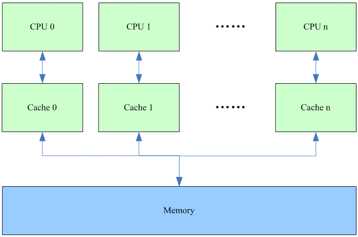
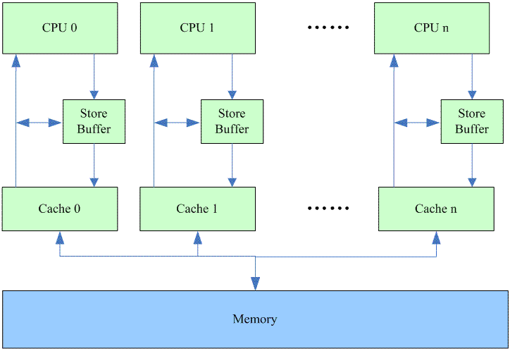
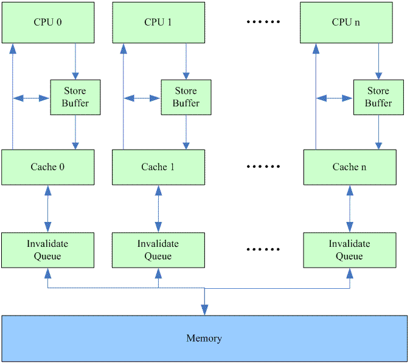
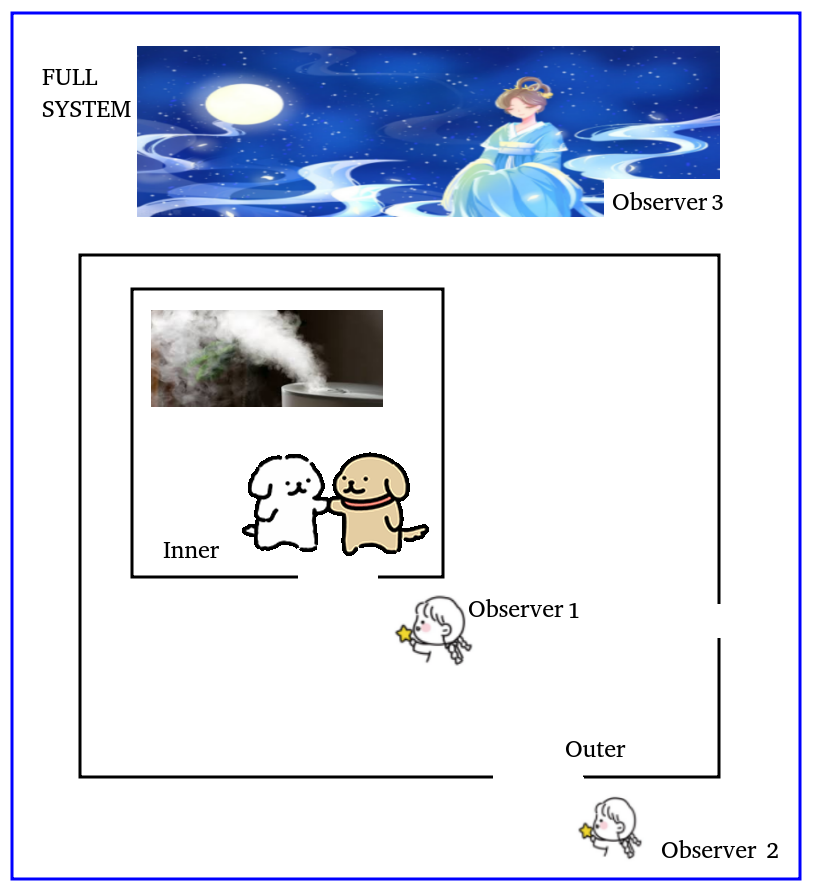
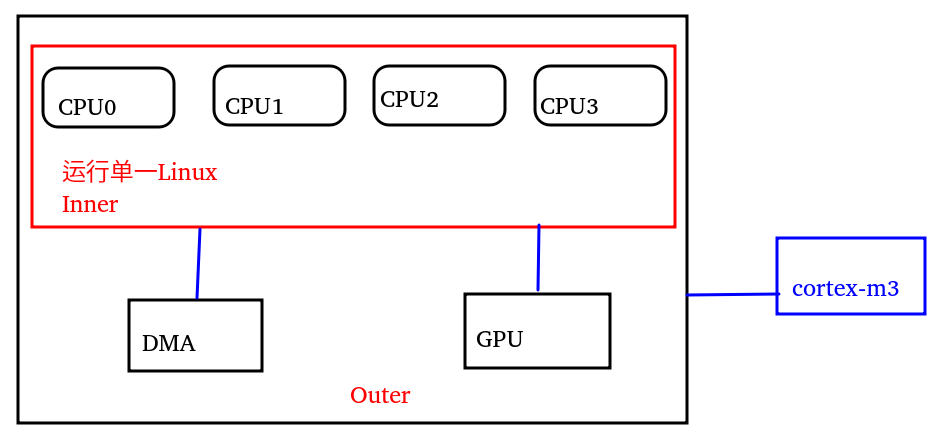
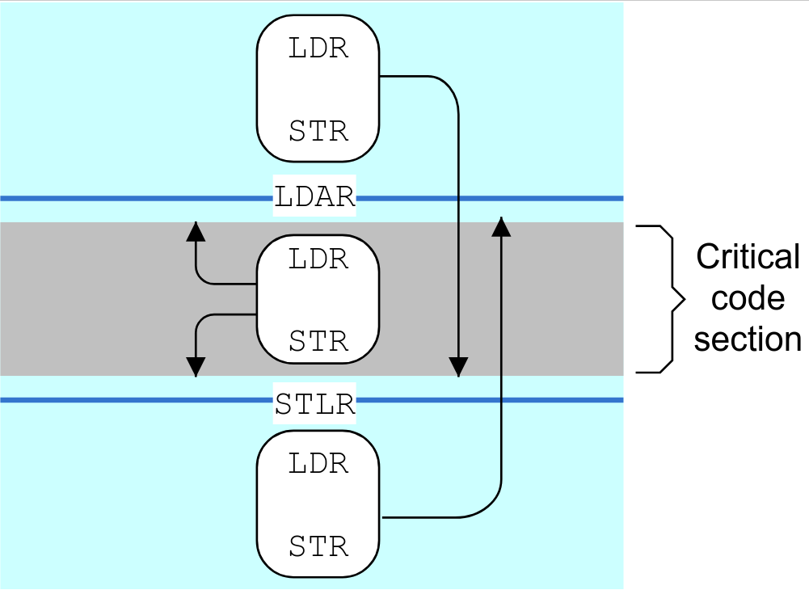
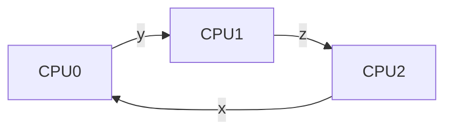

# 内存屏障

文章来源：http://www.wowotech.net/kernel_synchronization/memory-barrier.html

## 一、前言

我记得以前上学的时候大家经常说的一个词汇叫做所见即所得，有些编程工具是所见即所得的，给程序员带来极大的方便。对于一个c程序员，我们的编写的代码能所见即所得吗？我们看到的c程序的逻辑是否就是最后CPU运行的结果呢？很遗憾，不是，我们的“所见”和最后的执行结果隔着：

1. 编译器

2. CPU取指执行

编译器将符合人类思考的逻辑（c代码）翻译成了符合CPU运算规则的汇编指令，编译器了解底层CPU的思维模式，因此，它可以在将c翻译成汇编的时候进行优化（例如内存访问指令的重新排序），让产出的汇编指令在CPU上运行的时候更快。然而，这种优化产出的结果未必符合程序员原始的逻辑，因此，作为程序员，作为c程序员，必须有能力了解编译器的行为，并在通过内嵌在c代码中的memory barrier来指导编译器的优化行为 *（这种memory barrier又叫做优化屏障，Optimization barrier）* ，让编译器产出即高效，又逻辑正确的代码。

CPU的核心思想就是取指执行，对于in-order的单核CPU，并且没有cache *（这种CPU在现实世界中还存在吗？）* ，汇编指令的取指和执行是严格按照顺序进行的，也就是说，汇编指令就是所见即所得的，汇编指令的逻辑被严格的被CPU执行。然而，随着计算机系统越来越复杂 *（多核、cache、superscalar、out-of-order）* ，使用汇编指令这样贴近处理器的语言也无法保证其被CPU执行的结果的一致性，从而需要程序员告知CPU如何保证逻辑正确。

综上所述，memory barrier是一种保证内存访问顺序的一种方法，让系统中的HW block *（各个cpu、DMA controler、device等）* 对内存有一致性的视角。

## 二、不使用memory barrier会导致问题的场景

### 编译器的优化

我们先看下面的一个例子：
```c
preempt_disable()
临界区
preempt_enable()
```
有些共享资源可以通过禁止任务抢占来进行保护，因此临界区代码被`preempt_disable`和`preempt_enable`给保护起来。其实，我们知道所谓的preempt enable和disable其实就是对当前进程的`struct thread_info`中的`preempt_count`进行加一和减一的操作。具体的代码如下：
```c
#define preempt_disable() \
do { \
  preempt_count_inc(); \
  barrier(); \
} while (0)
```
linux kernel中的定义和我们的想像一样，除了barrier这个优化屏障。barrier就象是c代码中的一个栅栏，将代码逻辑分成两段，barrier之前的代码和barrier之后的代码在经过编译器编译后顺序不能乱掉。也就是说，barrier之后的c代码对应的汇编，不能跑到barrier之前去，反之亦然。之所以这么做是因为在我们这个场景中，如果编译为了榨取CPU的performace而对汇编指令进行重排，那么临界区的代码就有可能位于`preempt_count_inc`之外，从而起不到保护作用。

现在，我们知道了增加barrier的作用，问题来了，barrier是否够呢？对于multi-core的系统，只有当该task被调度到该CPU上执行的时候，该CPU才会访问该task的preempt count，因此对于preempt enable和disable而言，不存在多个CPU同时访问的场景。但是，即便这样，如果CPU是乱序执行（out-of-order excution）的呢？其实，我们也不用担心，正如前面叙述的，preempt count这个memory实际上是不存在多个cpu同时访问的情况，因此，它实际上会本cpu的进程上下文和中断上下文访问。能终止当前thread执行`preempt_disable`的只有中断。为了方便描述，我们给代码编址，如下：

| 地址 | 该地址的汇编指令    | CPU的执行顺序       |
| ---- | ------------------- | ------------------- |
| a    | preempt_disable（） | 临界区指令1         |
| a+4  | 临界区指令1         | preempt_disable（） |
| a+8  | 临界区指令2         | 临界区指令2         |
| a+12 | preempt_enable      | preempt_enable      |

即便CPU乱序执行，它也是设计为顺序提交的：确定了中断命中的指令之后，CPU要做的就是把那些提前执行但未提交的指令结果进行回滚。

上面描述的是优化屏障在内存中的变量的应用，下面我们看看硬件寄存器的场景。一般而言，串口的驱动都会包括控制台部分的代码，例如：
```c
static struct console xx_serial_console = {
……
  .write    = xx_serial_console_write,
……
};
```
如果系统enable了串口控制台，那么当你的驱动调用printk的时候，实际上最终是通过console的write函数输出到了串口控制台。而这个console write的函数可能会包含下面的代码：

```c
do {
  获取TX FIFO状态寄存器
  barrier();
} while (TX FIFO没有ready);
写TX FIFO寄存器;
```

对于某些CPU archtecture而言 *（至少ARM是这样的）* ，外设硬件的IO地址也被映射到了一段内存地址空间，对编译器而言，它并不知道这些地址空间是属于外设的。因此，对于上面的代码，如果没有barrier的话，获取TX FIFO状态寄存器的指令可能和写TX FIFO寄存器指令进行重新排序，在这种情况下，程序逻辑就不对了，因为我们必须要保证TX FIFO ready的情况下才能写TX FIFO寄存器。

对于multi core的情况，上面的代码逻辑也是OK的，因为在调用console write函数的时候，要获取一个console semaphore，确保了只有一个thread进入，因此，console write的代码不会在多个CPU上并发。和preempt count的例子一样，我们可以问同样的问题，如果CPU是乱序执行 *（out-of-order excution）* 的呢？barrier只是保证compiler输出的汇编指令的顺序是OK的，不能确保CPU执行时候的乱序。 对这个问题的回答来自ARM architecture的内存访问模型：对于program order是A1-->A2的情况 *（A1和A2都是对Device或是Strongly-ordered的memory进行访问的指令）* ，ARM保证A1也是先于A2执行的。因此，在这样的场景下，使用barrier足够了。 对于X86也是类似的，虽然它没有对IO space用memory mapping的方式，但是，X86的所有操作IO端口的指令都是被顺执行的，不需要考虑memory access order。

### cpu architecture和cache的组织

注：本章节的内容来自对Paul E. McKenney的Why memory barriers文档理解，更细致的内容可以参考该文档。这个章节有些晦涩，需要一些耐心。作为一个c程序员，你可能会抱怨，为何设计CPU的硬件工程师不能屏蔽掉memory barrier的内容，让c程序员关注在自己需要关注的程序逻辑上呢？本章可以展开叙述，或许能解决一些疑问。

#### 基本概念

在[The Memory Hierarchy](http://www.wowotech.net/basic_subject/memory-hierarchy.html)文档中，我们已经了解了关于cache一些基础的知识，一些基础的内容，这里就不再重复了。我们假设一个多核系统中的cache如下：



我们先了解一下各个cpu cache line状态的迁移过程：

1. 我们假设在有一个memory中的变量为多个CPU共享，那么刚开始的时候，所有的CPU的本地cache中都没有该变量的副本，所有的cacheline都是invalid状态。

2. 因此当CPU0 读取该变量的时候发生cache miss *（更具体的说叫做cold miss或者warmup miss）* 。当该值从memory中加载到cache 0中的cache line之后，该cache line的状态被设定为shared，而其他的cache都是Invalid。

3. 当CPU1 读取该变量的时候，cache 1中的对应的cache line也变成shared状态。其实shared状态就是表示共享变量在一个或者多个cpu的cache中有副本存在。既然是被多个cache所共享，那么其中一个CPU就不能武断修改自己的cache而不通知其他CPU的cache，否则会有一致性问题。

4. 总是read多没劲，我们让CPUn对共享变量来一个load and store的操作。这时候，CPUn发送一个read invalidate命令，加载了Cache n的cache line，并将状态设定为exclusive，同时将所有其他CPU的cache对应的该共享变量的cacheline设定为invalid状态。正因为如此，CPUn实际上是独占了变量对应的cacheline *（其他CPU的cacheline都是invalid了，系统中就这么一个副本）* ，就算是写该变量，也不需要通知其他的CPU。CPU随后的写操作将cacheline设定为modified状态，表示cache中的数据已经dirty，和memory中的不一致了。modified状态和exclusive状态都是独占该cacheline，但是modified状态下，cacheline的数据是dirty的，而exclusive状态下，cacheline中的数据和memory中的数据是一致的。当该cacheline被替换出cache的时候，modified状态的cacheline需要write back到memory中，而exclusive状态不需要。

5. 在cacheline没有被替换出CPUn的cache之前，CPU0再次读该共享变量，这时候会怎么样呢？当然是cache miss了 *（因为之前由于CPUn写的动作而导致其他cpu的cache line变成了invalid，这种cache miss叫做communiction miss）* 。此外，由于CPUn的cache line是modified状态，它必须响应这个读得操作 *（memory中是dirty的）* 。因此，CPU0的cacheline变成share状态 *（在此之前，CPUn的cache line应该会发生write back动作，从而导致其cacheline也是shared状态）* 。当然，也可能是CPUn的cache line不发生write back动作而是变成invalid状态，CPU0的cacheline变成modified状态，这和具体的硬件设计相关。

 

#### Store buffer

我们考虑另外一个场景：在上一节中step 5中的操作变成CPU0对共享变量进行写的操作。这时候，写的性能变得非常的差，因为CPU0必须要等到CPUn上的cacheline 数据传递到其cacheline之后，才能进行写的操作 *（CPUn上的cacheline 变成invalid状态，CPU0则切换成exclusive状态，为后续的写动作做准备）* 。而从一个CPU的cacheline传递数据到另外一个CPU的cacheline是非常消耗时间的，而这时候，CPU0的写的动作只是hold住，直到cacheline的数据完成传递。而实际上，这样的等待是没有意义的，因为cacheline的数据将会被覆盖掉。为了解决这个问题，多核系统中的cache修改如下：



这样，问题解决了，写操作不必等到cacheline被加载，而是直接写到store buffer中然后欢快的去干其他的活。在CPUn的cacheline把数据传递到其cache 0的cacheline之后，硬件将store buffer中的内容写入cacheline。

虽然性能问题解决了，但是逻辑错误也随之引入，我们可以看下面的例子：

我们假设`a`和`b`是共享变量，初始值都是0，可以被CPU0和CPU1访问。CPU0的cache中保存了`b`的值 *（exclusive状态）* ，没有`a`的值，而CPU1的cache中保存了`a`的值，没有`b`的值，CPU0执行的汇编代码是：

```assembly
ldr   r2, [pc, #28]  // 取变量a的地址
ldr   r4, [pc, #20]  // 取变量b的地址
mov   r3, #1
str   r3, [r2]       // a=1
str   r3, [r4]       // b=1
```

CPU1执行的代码是：

```assembly
ldr   r2, [pc, #28]  // 取变量a的地址
ldr   r3, [pc, #20]  // 取变量b的地址
start:
	ldr   r3, [r3]   // 取变量b的值
    cmp   r3, #0     // b的值是否等于0？
    beq   start      // 等于0的话跳转到start
    ldr   r2, [r2]   // 取变量a的值
```

当CPU1执行到取变量`a`的值这条指令的时候，`b`已经是被CPU0修改为1了，这也就是说a＝1这个代码已经执行了，因此，从汇编代码的逻辑来看，这时候`a`值应该是确定的1。然而并非如此，CPU0和CPU1执行的指令和动作描述如下：

| CPU0执行的指令 | CPU0动作描述                                                 | CPU1执行的指令 | CPU1动作描述                                                 |
| -------------- | ------------------------------------------------------------ | -------------- | ------------------------------------------------------------ |
| `a=1`          | 1. 发生cache miss<br>2. 将1保存在store buffer中<br>3. 发送read invalidate命令，试图从CPU1的cacheline中获取数据，并invalidate其cache line <br>注：这里无需等待response，立刻执行下一条指令 | 获取`b`的值    | 1. 发生cache miss<br>2. 发送read命令，试图加载`b`对应的cacheline <br>注：这里cpu必须等待read response，下面的指令依赖于这个读取的结果 |
| `b=1`          | 1. cache hit<br>2. cacheline中的值被修改为1，状态变成modified |                |                                                              |
|                | 响应CPU1的read命令，发送read response *（b＝1）* 给CPU0。write back，将状态设定为shared |                |                                                              |
|                |                                                              | `b==0`         | 1. CPU1收到来自CPU0的read response，加载b对应的cacheline，状态为shared<br>2. `b`等于1，因此不必跳转到start执行 |
|                |                                                              | 获取`a`的值    | 1. cache hit<br>2. 获取了`a`的旧值，也就是0                  |
|                |                                                              |                | 响应CPU0的read invalid命令，将`a`对应的cacheline设为invalid状态，发送read response和invalidate ack。但是已经酿成大错了。 |
|                | 收到来自CPU1的响应，将store buffer中的1写入cache line。      |                |                                                              |

对于硬件，CPU不清楚具体的代码逻辑，它不可能直接帮助软件工程师，只是提供一些memory barrier的指令，让软件工程师告诉CPU他想要的内存访问逻辑顺序。这时候，CPU0的代码修改如下：

```assembly
ldr   r2, [pc, #28]  // 取变量a的地址
ldr   r4, [pc, #20]  // 取变量b的地址
mov   r3, #1
str   r3, [r2]       // a=1
确保清空store buffer的memory barrier instruction
str   r3, [r4]       // b=1
```

这种情况下，CPU0和CPU1执行的指令和动作描述如下：

| CPU0执行的指令             | CPU0动作描述                                                 | CPU1执行的指令 | CPU1动作描述                                                 |
| -------------------------- | ------------------------------------------------------------ | -------------- | ------------------------------------------------------------ |
| `a=1`                      | 1. 发生cache miss<br/>2. 将1保存在store buffer中<br/>3. 发送read invalidate命令，试图从CPU1的cacheline中获取数据，并invalidate其cache line <br/>注：这里无需等待response，立刻执行下一条指令 | 获取`b`的值    | 1. 发生cache miss<br>2. 发送read命令，试图加载`b`对应的cacheline <br>注：这里cpu必须等待read response，下面的指令依赖于这个读取的结果 |
| memory barrier instruction | CPU收到memory barrier指令，知道软件要控制访问顺序，因此不会执行下一条str指令，要等到收到read response和invalidate ack后，将store buffer中所有数据写到cacheline之后才会执行后续的store指令 |                |                                                              |
|                            |                                                              | `b==0`         | 1. CPU1收到来自CPU0的read response，加载b对应的cacheline，状态为shared<br/>2. b等于0，跳转到start执行 |
|                            |                                                              |                | 响应CPU0的read invalid命令，将a对应的cacheline设为invalid状态，发送read response和invalidate ack。 |
|                            | 收到来自CPU1的响应，将store buffer中的1写入cache line。      |                |                                                              |
| `b=1`                      | 1. cache hit，但是cacheline状态是shared，需要发送invalidate到CPU1<br>2. 将1保存在store buffer中 <br>注：这里无需等待invalidate ack，立刻执行下一条指令 |                |                                                              |
| …                          | …                                                            | …              | …                                                            |

由于增加了memory barrier，保证了`a`、`b`这两个变量的访问顺序，从而保证了程序逻辑。

#### Invalidate Queue

我们先回忆一下为何出现了store buffer：为了加快cache miss状态下写的性能，硬件提供了store buffer，以便让CPU先写入，从而不必等待invalidate ack *（这些交互是为了保证各个cpu的cache的一致性）* 。然而，store buffer的size比较小，不需要特别多的store命令 *（假设每次都是cache miss）* 就可以将store buffer填满，这时候，没有空间写了，因此CPU也只能是等待invalidate ack了，这个状态和memory barrier指令的效果是一样的。

怎么解决这个问题？CPU设计的硬件工程师对性能的追求是不会停歇的。我们首先看看invalidate ack为何如此之慢呢？这主要是因为cpu在收到invalidate命令后，要对cacheline执行invalidate命令，确保该cacheline的确是invalid状态后，才会发送ack。如果cache正忙于其他工作，当然不能立刻执行invalidate命令，也就无法ack。

怎么破？CPU设计的硬件工程师提供了下面的方法：



Invalidate Queue这个HW block从名字就可以看出来是保存invalidate请求的队列。其他CPU发送到本CPU的invalidate命令会保存于此，这时候，并不需要等到实际对cacheline的invalidate操作完成，CPU就可以回invalidate ack了。

同store buffer一样，虽然性能问题解决了，但是对memory的访问顺序导致的逻辑错误也随之引入，我们可以看下面的例子 *（和store buffer中的例子类似）* ：

我们假设`a`和`b`是共享变量，初始值都是0，可以被CPU0和CPU1访问。CPU0的cache中保存了`b`的值 *（exclusive状态）* ，而CPU1和CPU0的cache中都保存了`a`的值，状态是shared。CPU0执行的汇编代码是：
```assembly
ldr   r2, [pc, #28]  // 取变量a的地址
ldr   r4, [pc, #20]  // 取变量b的地址
mov   r3, #1
str   r3, [r2]       // a=1

确保清空store buffer的memory barrier instruction
str   r3, [r4]       // b=1
```

CPU1执行的代码是：

```assembly
ldr   r2, [pc, #28]  // 取变量a的地址
ldr   r3, [pc, #20]  // 取变量b的地址
start:
	ldr   r3, [r3]   // 取变量b的值
    cmp   r3, #0     // b的值是否等于0？
    beq   start      // 等于0的话跳转到start
    ldr   r2, [r2]   // 取变量a的值
```

这种情况下，CPU0和CPU1执行的指令和动作描述如下：

| CPU0执行的指令             | CPU0动作描述                                                 | CPU1执行的指令 | CPU1动作描述                                                 |
| -------------------------- | ------------------------------------------------------------ | -------------- | ------------------------------------------------------------ |
| `a=1`                      | 1. `a`值在CPU0的cache中状态是shared，是read only的，因此，需要通知其他的CPU<br>2. 将1保存在store buffer中<br>3. 发送invalidate命令，试图invalidate CPU1中`a`对应的cache line <br>注：这里无需等待response，立刻执行下一条指令 | 获取`b`的值    | 1. 发生cache miss<br>2. 发送read命令，试图加载`b`对应的cacheline  <br>注：这里cpu必须等待read response，下面的指令依赖于这个读取的结果 |
|                            |                                                              |                | 收到来自CPU0的invalidate命令，放入invalidate queue，立刻回ack。 |
| memory barrier instruction | CPU收到memory barrier指令，知道软件要控制访问顺序，因此不会执行下一条str指令，要等到收到invalidate ack后，将store buffer中所有数据写到cacheline之后才会执行后续的store指令 |                |                                                              |
|                            | 收到invalidate ack后，将store buffer中的1写入cache line。OK，可以继续执行下一条指令了 |                |                                                              |
| `b=1`                      | 1. cache hit<br>2. cacheline中的值被修改为1，状态变成modified |                |                                                              |
|                            | 收到CPU1发送来的read命令，将b值 *（等于1）* 放入read response中，回送给CPU1，write back并将状态修改为shared。 |                |                                                              |
|                            |                                                              |                | 收到response *（b＝1）* ，并加载cacheline，状态是shared        |
|                            |                                                              | `b==0`         | `b`等于1，不会执行beq指令，而是执行下一条指令                |
|                            |                                                              | 获取`a`的值    | 1. cache hit *（还没有执行invalidate动作，命令还在invalidate queue中呢）* <br>2. 获取了`a`的旧值，也就是0 |
|                            |                                                              |                | 对`a`对应的cacheline执行invalidate 命令，但是，已经晚了      |

可怕的memory misorder问题又来了，都是由于引入了invalidate queue引起，看来我们还需要一个memory barrier的指令，我们将程序修改如下：

```assembly
ldr   r2, [pc, #28]  // 取变量a的地址
ldr   r3, [pc, #20]  // 取变量b的地址
start:
    ldr   r3, [r3]   // 取变量b的值
    cmp   r3, #0     // b的值是否等于0？
    beq   start      // 等于0的话跳转到start
    确保清空invalidate queue的memory barrier instruction
    ldr   r2, [r2]   // 取变量a的值
```

这种情况下，CPU0和CPU1执行的指令和动作描述如下：

| CPU0执行的指令             | CPU0动作描述                                                 | CPU1执行的指令             | CPU1动作描述                                                 |
| -------------------------- | ------------------------------------------------------------ | -------------------------- | ------------------------------------------------------------ |
| `a=1`                      | 1. `a`值在CPU0的cache中状态是shared，是read only的，因此，需要通知其他的CPU<br/>2. 将1保存在store buffer中<br/>3. 发送invalidate命令，试图invalidate CPU1中`a`对应的cache line <br/>注：这里无需等待response，立刻执行下一条指令 | 获取`b`的值                | 1. 发生cache miss<br/>2. 发送read命令，试图加载`b`对应的cacheline  <br/>注：这里cpu必须等待read response，下面的指令依赖于这个读取的结果 |
|                            |                                                              |                            | 收到来自CPU0的invalidate命令，放入invalidate queue，立刻回ack。 |
| memory barrier instruction | CPU收到memory barrier指令，知道软件要控制访问顺序，因此不会执行下一条str指令，要等到收到invalidate ack后，将store buffer中所有数据写到cacheline之后才会执行后续的store指令 |                            |                                                              |
|                            | 收到invalidate ack后，将store buffer中的1写入cache line。OK，可以继续执行下一条指令了 |                            |                                                              |
| `b=1`                      | 1. cache hit<br>2. cacheline中的值被修改为1，状态变成modified |                            |                                                              |
|                            | 收到CPU1发送来的read命令，将b值 *（等于1）* `放入read response中，回送给CPU1，write back并将状态修改为shared。 |                            |                                                              |
|                            |                                                              |                            | 收到response *（b＝1）* ，并加载cacheline，状态是shared        |
|                            |                                                              | `b==0`                     | b等于1，不会执行beq指令，而是执行下一条指令                  |
|                            |                                                              | memory barrier instruction | CPU收到memory barrier指令，知道软件要控制访问顺序，因此不会执行下一条ldr指令，要等到执行完invalidate queue中的所有的invalidate命令之后才会执行下一个ldr指令 |
|                            |                                                              | 获取`a`的值                | 1. cache miss<br>2. 发送read命令，从CPU0那里加载新的`a`值    |

 由于增加了memory barrier，保证了`a`、`b`这两个变量的访问顺序，从而保证了程序逻辑。

## 三、linux kernel的API

linux kernel的memory barrier相关的API列表如下：

| 接口名称    | 作用                                                         |
| ----------- | ------------------------------------------------------------ |
| `barrier()` | 优化屏障，阻止编译器为了进行性能优化而进行的memory access reorder |
| `mb()`      | 内存屏障 *（包括读和写）* ，用于SMP和UP                        |
| `rmb()`     | 读内存屏障，用于SMP和UP                                      |
| `wmb()`     | 写内存屏障，用于SMP和UP                                      |
| `smp_mb()`  | 用于SMP场合的内存屏障，对于UP不存在memory order的问题 *（对汇编指令）* ，因此，在UP上就是一个优化屏障，确保汇编和c代码的memory order是一致的 |
| `smp_rmb()` | 用于SMP场合的读内存屏障                                      |
| `smp_wmb()` | 用于SMP场合的写内存屏障                                      |

barrier()这个接口和编译器有关，对于gcc而言，其代码如下：

```c
#define barrier() __asm__ __volatile__("": : :"memory")
```

这里的`__volatile__`主要是用来防止编译器优化的。而这里的优化是针对代码块而言的，使用嵌入式汇编的代码分成三块：

1. 嵌入式汇编之前的c代码块

2. 嵌入式汇编代码块

3. 嵌入式汇编之后的c代码块

这里`__volatile__`就是告诉编译器：不要因为性能优化而将这些代码重排，我需要清清爽爽的保持这三块代码块的顺序 *（代码块内部是否重排不是这里的`__volatile__`管辖范围了）* 。

`barrier`中的嵌入式汇编中的clobber list没有描述汇编代码对寄存器的修改情况，只是有一个memory的标记。我们知道，clober list是gcc和gas的接口，用于gas通知gcc它对寄存器和memory的修改情况。因此，这里的memory就是告知gcc，在汇编代码中，我修改了memory中的内容，嵌入式汇编之前的c代码块和嵌入式汇编之后的c代码块看到的memory是不一样的，对memory的访问不能依赖于嵌入式汇编之前的c代码块中寄存器的内容，需要重新加载。

优化屏障是和编译器相关的，而内存屏障是和CPU architecture相关的，当然，我们选择ARM为例来描述内存屏障。

## 四、ARM64的具体实现

典型的ARM64有这么几种屏障：

- `dmb`：Data Memory Barrier
- `dsb`：Data Synchronization Barrier
- `isb`：Instruction Synchronization Barrier
- `ldar`(Load-Acquire)/`stlr`(Store-Release)

看手册是没法看的，不信来看一个`dmb`的定义：

> The Data Memory Barrier (DMB) prevents the reordering of specified explicit data accesses across the barrier instruction. All explicit data load or store instructions, which are executed by the PE in program order before the DMB, are observed by all Observers within a specified Shareability domain before the data accesses after the DMB in program order.

我们来浅显一下，2个狗在一个inner shareable domain里面，比如是自己的家门里面；然后是在一个outer shareable domain里面，比如是小区的出口；最后在太阳系里面。这2只小狗，出每一道门，都有observer可以看见它，observer1是inner的，observer2是outer的，天上的observer嫦娥属于full system。



现在我们提出如下需求：

1. 黄狗狗出门后白狗狗出门

2. 黄狗狗和白狗狗出门后，放烟雾消杀

### 首先谁和谁保序

在硬件层面，我们强行认为对狗狗的操作是`ldr`、`str`之类的内存操作，消杀是计算或者`msr`之类的非内存操作。这里就涉及到`dmb`和`dsb`的一个本质区别，`dmb`针对的是memory的load/store之间；`dsb`强调的是同类或不同类事物的先后完成。所以对于这个场景，我们正确的屏障是：

```c
load 黄狗狗
dmb ??
load 白狗狗
dsb ??
msr 消毒烟雾
```

第一个是`dmb`，第2个是`dsb`。上面`dmb`和`dsb`后面都加了两个？，证明这里有情况，什么情况？接着看。

### 其次observer在哪里

比如是家门口的小姑娘observer1 *（ISH,inner shareable）*、还是小区门口的小姑娘observer2 *（OSH，outer shareable）* ，还是天上的嫦娥呢 *（SY, Full System）*？如果只是observer1看到黄狗狗先出门，白狗狗再出门，延迟显然更小。在越大的访问范围保序，硬件的延迟越大。假设我们现在的保序需求是：

1. 小区门口(outer shareable)的observer2先看到黄狗狗出来，再看到白狗狗出来

2. 家门口(inner shareable)的observer1先看到两只狗狗出来，再看到放烟雾

对于这个场景，我们正确的屏障是：

```c
load 黄狗狗
dmb osh?
load 白狗狗
dsb ish?
msr 消毒烟雾
```

在`dmb`后面我们跟的是`osh`，在`dsb`后面我们跟的是`ish`，是因为observer的位置不一样。注意，能用小observer的不用大observer。在一个典型的ARM64系统里面，运行Linux的各个CPU在一个inner；而GPU，DMA和CPU则同位于一个outer；当然还有可能孤悬海外的一个Cortex-M3的MCU,尽管可以和CPU以某种方式通信，但是不太参与inner以及outer里面的总线interconnect。



### 最后保序方向是什么

前面我们只关心狗狗的出门 *（load）* ，假设两只狗狗都是进门 *（store）* 呢？或者我们现在要求黄狗狗先进门，白狗狗再出门呢？这个时候，我们要约束屏障的方向。

比如下面的代码，约束了observer1(inner)先看到黄狗狗出门，再看到白狗狗出门：


```c
load 黄狗狗
dmb ishld
load 白狗狗
```

比如下面的代码，约束了observer2(outer)先看到黄狗狗进门，再看到白狗狗进门：

```c
store 黄狗狗
dmb oshst
store 白狗狗
```

这里我们看到一个用的是LD，一个用的是ST。我们再来看几个栗子，它们都是干什么的:

1. 
    ```c
    A(load); dmb ishld; B; C(load/store)
    ```
    保证Inner内，A和C的顺序，只要A是load，无论C是load还是store；如果B既不是load也不是store，而是别的性质的事情，则dmb完全管不到B

2. 
    ```c
    A(load); dsb ishld; B; C(load/store)
    ```
    保证Inner内，A和C的顺序，只要A是load，无论C是load还是store；无论B是什么事情，inner都先到干完了A，再干B。

3. 
    ```c
    A(store); dmb ishld; B; C(store)
    ```
    A,B,C三个东西完全乱序，因为dmb约束不了性质不同的B，ld约束不了A和C的store顺序。

4. 
    ```c
    A(store); dmb ishst; B; C(store)
    ```
    st约束了A和C 2个东西在inner这里看起来是顺序的，因为dmb约束不了B，所以B和A、C之间乱序

注意上述4个屏障，由于都是ish,故都不能保证observer2和observer3的顺序，在observer2和3眼里，上述所有屏障，A、B、C都是乱序的。另外，如果无论什么方向，我们都要保序，我们可以去掉ld和st，这样的保序方向是any-any。

到这里我们要牢记3个point：**谁和谁保序；在哪里保序；朝哪个方向保序**。由此，我们可以清楚地看到`dmb`和`dsb`的区别，一个是保序内存load/store；一个是保序内存load/store + 其他指令。

`isb`的性质会有很大的不同，`isb`主要用于刷新处理器中的pipeline，因此可确保在`isb`指令完成后，才从内存系统中fetch位于该指令后的其他指令。比如你更新了代码段的PTE，需要重新取指。

而`ldar` *(Load-Acquire)* /`STLR` *(Store-Release)* 则是比较新的one-way barrier。`stlr`堵住了前面的`ldr`/`str`往后面跑，`ldar`堵住了后面`ldr`/`str`往前面跑。夹在`ldar`和`stlr`之间的`ldr`/`str`相当于被在死胡同里，哪里也去不了。



注意，`ldar`/`stlr`与前面的`dmb`/`dsb`有本质的不同，它本身是要跟地址的。比如现在家里有3只狗狗：白、黄、红，当：

```c
ldr 白狗狗
ldar 红狗狗
ldr 黄狗狗
```

黄狗狗被红狗狗的`ldar`挡住了，而白狗狗没有被任何东西挡住，它可以:

1. 第一个出门
2. 红尾哈巴狗出门后，黄狗狗出门前出门
3. 最后一个出门。

### API对应

| 接口名称               | 作用                                                         |
| ---------------------- | ------------------------------------------------------------ |
| `barrier()`            | 优化屏障，阻止编译器为了进行性能优化而进行的memory access reorder |
| `mb()`                 | `dsb sy`                                                     |
| `rmb()`                | `dsb ld`                                                     |
| `wmb()`                | `dsb st`                                                     |
| `smp_mb()`             | `dmb ish`                                                    |
| `smp_rmb()`            | `dmb ishld`                                                  |
| `smp_wmb()`            | `dmb ishst`                                                  |
| `dma_mb()`             | `dmb osh`                                                    |
| `dma_rmb()`            | `dmb oshld`                                                  |
| `dma_wmb()`            | `dmb oshst`                                                  |
| `smp_load_acquire(p)`  | `ldarb wx, [p]` `ldarh wx, [p]` `ldar wx, [p]` `ldar xx, [p]` |
| `smp_store_release(p)` | `stlrb wx, [p]` `stlrh wx, [p]` `stlr wx, [p]` `stlr xx, [p]` |

`smp_load_acquire(p)`/`smp_store_release(p)`可以运行在不同的CPU上，只要地址p对应就会产生保序:



```c
unsigned long x, y, z;
void cpu0(void)
{
    unsigned long q = smp_load_acquire(&x);
    smp_store_release(&y, 1ul);
}
void cpu1(void)
{
    unsigned long q = smp_load_acquire(&y);
    smp_store_release(&z, 1ul);
}
void cpu2(void)
{
    unsigned long q = smp_load_acquire(&z);
    smp_store_release(&x, 1ul);
}
```

### 例子

#### Linux的多核通过中断通信

CPU0在DDR填入一段数据，然后通过store指令写intr寄存器向CPU1发送中断。

```c
store 数据
barrier?
store intr
```

中间应该用什么barrier？我们来回忆一下三要素：

- 谁和谁保序 -> CPU0和CPU1这2个observer之间看到保序

- 在哪里保序 -> 只需要CPU1看到CPU0写入DDR和intr寄存器是保序的

- 朝哪个方向保序 -> CPU0写入一段数据，然后写入intr寄存器，只需要在st方向保序。

应该使用的barrier是：`dmb + ish + st`。显然是`smp_wmb()`。内核代码 *drivers/irqchip/irq-bcm2836.c* 也可以证实这一点：

```c
static void bcm2836_arm_irqchip_ipi_send_mask(struct irq_data *d,
					      const struct cpumask *mask)
{
	int cpu;
	void __iomem *mailbox0_base = intc.base + LOCAL_MAILBOX0_SET0;
	/*
	 * Ensure that stores to normal memory are visible to the
	 * other CPUs before issuing the IPI.
	 */
	smp_wmb();
	for_each_cpu(cpu, mask)
		writel_relaxed(BIT(d->hwirq), mailbox0_base + 16 * cpu);
}
```

现在我们把intr换成gic-v3，就会变地tricky很多。gic-v3的ipi寄存器并不是映射到内存空间的，而是一个sys寄存器，通过`msr`来写入。前面我们说过`dmb`只能搞定load/store之间，搞不定load/store与其他东西之间。最开始的gic-v3驱动的作者其实也误用了`mp_wmb`，造成了该驱动的稳定性问题。于是Shanker Donthineni进行了一个修复，这个修复的commit如下

```diff
commit 21ec30c0ef5234fb1039cc7c7737d885bf875a9e
Author: Shanker Donthineni <shankerd@codeaurora.org>
Date:   Wed Jan 31 18:03:42 2018 -0600

    irqchip/gic-v3: Use wmb() instead of smb_wmb() in gic_raise_softirq()
    
    A DMB instruction can be used to ensure the relative order of only
    memory accesses before and after the barrier. Since writes to system
    registers are not memory operations, barrier DMB is not sufficient
    for observability of memory accesses that occur before ICC_SGI1R_EL1
    writes.
    
    A DSB instruction ensures that no instructions that appear in program
    order after the DSB instruction, can execute until the DSB instruction
    has completed.
--- a/drivers/irqchip/irq-gic-v3.c
+++ b/drivers/irqchip/irq-gic-v3.c
@@ -688,7 +688,7 @@ static void gic_raise_softirq(const struct cpumask *mask, unsigned int irq)
         * Ensure that stores to Normal memory are visible to the
         * other CPUs before issuing the IPI.
         */
-       smp_wmb();
+       wmb();
 
        for_each_cpu(cpu, mask) {
                u64 cluster_id = MPIDR_TO_SGI_CLUSTER_ID(cpu_logical_map(cpu));
```

这个commit解释了我们不能用`dmb`搞定memory和sysreg之间的事情，于是这个patch替换为了更强力的`wmb()`，那么这个替换是正确的吗？

我们还是套一下三要素：

1. 谁和谁保序 -> CPU0和CPU1保序

2. 在哪里保序 -> 只需要CPU1看到CPU0写入DDR后，再看到它写sysreg

3. 朝哪个方向保序 -> CPU0写入一段数据，然后写入sysreg寄存器，只需要在st方向保序。

我们要进行保序的是CPU0和CPU1之间，显然他们属于inner。于是，我们得出正确的barrier应该是：`dsb + ish + st`，`wmb()`属于用力过猛了，因为`wmb = dsb(st)`，保序范围是full system。基于此，Barry Song再次在主线内核对Shanker Donthineni的修复进行了修复，缩小屏障的范围，提升性能：


```diff
commit 80e4e1f472889f31a4dcaea3a4eb7a565296f1f3
Author: Barry Song <song.bao.hua@hisilicon.com>
Date:   Sun Feb 20 19:19:10 2022 +1300

    irqchip/gic-v3: Use dsb(ishst) to order writes with ICC_SGI1R_EL1 accesses
    
    A dsb(ishst) barrier should be enough to order previous writes with
    the system register generating the SGI, as we only need to guarantee
    the visibility of data to other CPUs in the inner shareable domain
    before we send the SGI.
--- a/drivers/irqchip/irq-gic-v3.c
+++ b/drivers/irqchip/irq-gic-v3.c
@@ -1211,7 +1211,7 @@ static void gic_ipi_send_mask(struct irq_data *d, const struct cpumask *mask)
         * Ensure that stores to Normal memory are visible to the
         * other CPUs before issuing the IPI.
         */
-       wmb();
+       dsb(ishst);
 
        for_each_cpu(cpu, mask) {
                u64 cluster_id = MPIDR_TO_SGI_CLUSTER_ID(cpu_logical_map(cpu));
```

#### 写入数据到内存后发起DMA

下面我们把需求变更为，CPU写入一段数据后，写Ethernet控制器与CPU之间的doorbell，发起DMA操作发包。

1. 谁和谁保序 -> CPU和EMAC的DMA保序,DMA和CPU显然不是inner

2. 在哪里保序 -> 只需要EMAC的DMA看到CPU写入发包数据后，再看到它写doorbell

3. 朝哪个方向保序 -> CPU写入一段数据，然后写入doorbell，只需要在st方向保序。

于是，我们得出正确的barrier应该是：`dmb + osh + st,`为什么是dmb呢，因为doorbell也是store写的。我们来看看Yunsheng Lin的这个commit，它把用力过猛的`wmb()`，替换成了用`writel()`来写doorbell:

```diff
commit 48ee56fd0b3785481a521fb7daaf1465219fc3af
Author: Yunsheng Lin <linyunsheng@huawei.com>
Date:   Wed Sep 16 17:33:49 2020 +0800

    net: hns3: use writel() to optimize the barrier operation
    
    writel() can be used to order I/O vs memory by default when
    writing portable drivers. Use writel() to replace wmb() +
    writel_relaxed(), and writel() is dma_wmb() + writel_relaxed()
    for ARM64, so there is an optimization here because dma_wmb()
    is a lighter barrier than wmb().
    
--- a/drivers/net/ethernet/hisilicon/hns3/hns3_enet.c
+++ b/drivers/net/ethernet/hisilicon/hns3/hns3_enet.c
@@ -1398,9 +1398,8 @@ static void hns3_tx_doorbell(struct hns3_enet_ring *ring, int num,
        if (!ring->pending_buf)
                return;
 
-       wmb(); /* Commit all data before submit */
-
-       hnae3_queue_xmit(ring->tqp, ring->pending_buf);
+       writel(ring->pending_buf,
+              ring->tqp->io_base + HNS3_RING_TX_RING_TAIL_REG);
        ring->pending_buf = 0;
        WRITE_ONCE(ring->last_to_use, ring->next_to_use);
 }
```

在ARM64平台下，`writel`内嵌了一个`dmb + osh + st`。同样的逻辑也可能发生在CPU与其他outer组件之间，比如CPU与ARM64的SMMU:

```diff
commit 77f3445866c39d8866b31d8d9fa47c7c20938e05
Author: Will Deacon <will@kernel.org>
Date:   Fri Jun 23 12:02:38 2017 +0100

    iommu/io-pgtable-arm: Use dma_wmb() instead of wmb() when publishing table
    
    When writing a new table entry, we must ensure that the contents of the
    table is made visible to the SMMU page table walker before the updated
    table entry itself.
    
    This is currently achieved using wmb(), which expands to an expensive and
    unnecessary DSB instruction. Ideally, we'd just use cmpxchg64_release when
    writing the table entry, but this doesn't have memory ordering semantics
    on !SMP systems.
    
    Instead, use dma_wmb(), which emits DMB OSHST. Strictly speaking, this
    does more than we require (since it targets the outer-shareable domain),
    but it's likely to be significantly faster than the DSB approach.
--- a/drivers/iommu/io-pgtable-arm-v7s.c
+++ b/drivers/iommu/io-pgtable-arm-v7s.c
@@ -408,8 +408,12 @@ static arm_v7s_iopte arm_v7s_install_table(arm_v7s_iopte *table,
        if (cfg->quirks & IO_PGTABLE_QUIRK_ARM_NS)
                new |= ARM_V7S_ATTR_NS_TABLE;
 
-       /* Ensure the table itself is visible before its PTE can be */
-       wmb();
+       /*
+        * Ensure the table itself is visible before its PTE can be.
+        * Whilst we could get away with cmpxchg64_release below, this
+        * doesn't have any ordering semantics when !CONFIG_SMP.
+        */
+       dma_wmb();
 
        old = cmpxchg_relaxed(ptep, curr, new);
        __arm_v7s_pte_sync(ptep, 1, cfg);
```

#### CPU与MCU通过共享内存和hwspinlock通信

下面我们把场景变更为主CPU和另外一个cortex-m的MCU通过一片共享内存通信，对这片共享内存的访问透过硬件里面自带的hwspinlock（hardware spinlock）来解决。我们想象CPU持有了hwspinlock，然后读取对方cortex-m给它写入共享内存的数据，并写入一些数据到共享内存，然后解锁spinlock，通知cortex-m，这个时候cortex-m很快就可以持有锁。

1. 谁和谁保序 -> CPU和Cortex-M保序

2. 在哪里保序  -> CPU读写共享内存后，写入hwspinlock寄存器解锁，需要cortex-m看到同样的顺序

3. 朝哪个方向保序 -> CPU读写数据，然后释放hwspinlock，我们要保证，CPU的写入对cortex-m可见；我们同时要保证，CPU放锁前的共享内存读已经完成，如果我们不能保证解锁之前CPU的读已经完成，cortex-m很可能马上写入新数据，然后CPU读到新的数据。所以这个保序是双向的。

```c
void __hwspin_unlock(struct hwspinlock *hwlock, int mode, unsigned long *flags)
{
        if (WARN_ON(!hwlock || (!flags && mode == HWLOCK_IRQSTATE)))
                return;

        /*
         * We must make sure that memory operations (both reads and writes),
         * done before unlocking the hwspinlock, will not be reordered
         * after the lock is released.
         *
         * That's the purpose of this explicit memory barrier.
         *
         * Note: the memory barrier induced by the spin_unlock below is too
         * late; the other core is going to access memory soon after it will
         * take the hwspinlock, and by then we want to be sure our memory
         * operations are already observable.
         */
        mb();

        hwlock->bank->ops->unlock(hwlock);

        /* Undo the spin_trylock{_irq, _irqsave} called while locking */
        switch (mode) {
        case HWLOCK_IRQSTATE:
                spin_unlock_irqrestore(&hwlock->lock, *flags);
                break;
        case HWLOCK_IRQ:
                spin_unlock_irq(&hwlock->lock);
                break;
        case HWLOCK_RAW:
        case HWLOCK_IN_ATOMIC:
                /* Nothing to do */
                break;
        default:
                spin_unlock(&hwlock->lock);
                break;
        }
}
```

里面用的是`mb()`，这是一个`dsb+full system+ld+st`

#### SMMU与CPU通过一个queue通信

现在我们把场景切换为，SMMU与CPU之间，通过一片放入共享内存的queue来通信，比如SMMU要通知CPU一些什么event，它会把event放入queue，放完了SMMU会更新另外一个pointer内存，表示queue增长到哪里了。

然后CPU通过这样的逻辑来工作

```c
if (pointer满足条件)
    load queue里的内容;
```

这是一种典型的控制依赖，而控制依赖并不能被硬件自动保序，CPU完全可以在`if(pointer满足什么条件)`满足之前，投机load了queue的内容，从而load到了错误的queue内容。

1. 谁和谁保序 -> CPU和SMMU保序

2. 在哪里保序 -> 要保证CPU先读取SMMU的pointer后，再读取SMMU写入的queue；

3. 朝哪个方向保序 -> CPU读pointer，再读queue内容，在load方向保序

于是，我们得出正确的barrier应该是：`dmb + osh + ld`,我们来看看wangzhou的这个修复：

```diff
commit a76a37777f2c936b1f046bfc0c5982c958b16bfe
Author: Zhou Wang <wangzhou1@hisilicon.com>
Date:   Mon Sep 28 16:32:02 2020 +0800

    iommu/arm-smmu-v3: Ensure queue is read after updating prod pointer
    
    Reading the 'prod' MMIO register in order to determine whether or not
    there is valid data beyond 'cons' for a given queue does not provide
    sufficient dependency ordering, as the resulting access is address
    dependent only on 'cons' and can therefore be speculated ahead of time,
    potentially allowing stale data to be read by the CPU.
    
    Use readl() instead of readl_relaxed() when updating the shadow copy of
    the 'prod' pointer, so that all speculated memory reads from the
    corresponding queue can occur only from valid slots.
--- a/arch/arm64/include/asm/barrier.h
+++ b/arch/arm64/include/asm/barrier.h
@@ -45,6 +45,7 @@
 #define rmb()          dsb(ld)
 #define wmb()          dsb(st)
 
+#define dma_mb()       dmb(osh)
 #define dma_rmb()      dmb(oshld)
 #define dma_wmb()      dmb(oshst)

--- a/arch/arm64/include/asm/io.h
+++ b/arch/arm64/include/asm/io.h
@@ -110,6 +110,7 @@ static inline u64 __raw_readq(const volatile void __iomem *addr)
 
 #define __io_par(v)            __iormb(v)
 #define __iowmb()              dma_wmb()
+#define __iomb()               dma_mb()

--- a/drivers/iommu/arm/arm-smmu-v3/arm-smmu-v3.c
+++ b/drivers/iommu/arm/arm-smmu-v3/arm-smmu-v3.c
@@ -810,7 +810,7 @@ static void queue_sync_cons_out(struct arm_smmu_queue *q)
         * Ensure that all CPU accesses (reads and writes) to the queue
         * are complete before we update the cons pointer.
         */
-       mb();
+       __iomb();
        writel_relaxed(q->llq.cons, q->cons_reg);
 }
```

ARM64平台的`readl()`也内嵌了`dmb + osh + ld`屏障。显然这个修复的价值是非常大的，这是一个由弱变强的过程。前面我们说过，由强变弱是性能问题，而由弱变强则往往修复的是稳定性问题。也就是这种用错了弱barrier的场景，往往bug非常难再现，需要很长时间的测试才再现一次。

#### 修改页表PTE后刷新tlb

现在我们的故事演变成了，CPU0修改了页表PTE，然后通知其他所有CPU，PTE应该被更新，其他CPU需要刷新TLB。它的一般流程是CPU调用`set_pte_at修改了内存里面的PTE，然后进行tlbi等动作。这里就变地非常复杂了：

```c
set_pte_at // 这个是store
barrier1?
tlbi  // 不是ldr/str
barrier2?  // 等tlbi完成
barrier3?  // 抛弃pipeline里面指令
```

我们看看barrier1，它在屏障store和tlbi之间，由于二者一个是狗狗，一个是消杀烟雾，显然不能是`dmb`，只能是`dsb`；我们需要CPU1看到`set_pte_at`的动作先于tlbi的动作，所以这个屏障的范围应该是ish；由于屏障需要保障的是`set_pte_at`的store，而不是load，所以方向是st，由此我们得出第一个barrier应该是：`dsb + ish + st`。

在 *arch/arm64/include/asm/tlbflush.h* 中：

```c
dsb(ishst);
asid = ASID(vma->vm_mm);

if (last_level)
     __flush_tlb_range_op(vale1is, start, pages, stride, asid, tlb_level, true);
else
     __flush_tlb_range_op(vae1is, start, pages, stride, asid, tlb_level, true);
dsb(ish);
mmu_notifier_arch_invalidate_secondary_tlbs(vma->vm_mm, start, end);
```
