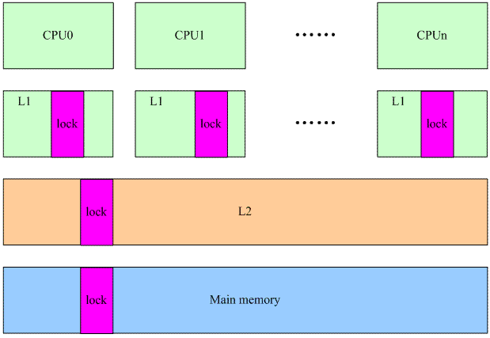
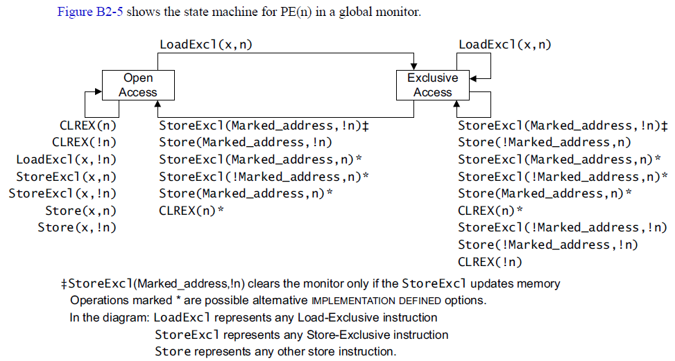

# 自旋锁

文章来源：http://www.wowotech.net/kernel_synchronization/spinlock.html

## 一、前言

在linux kernel的实现中，经常会遇到这样的场景：共享数据被中断上下文和进程上下文访问，该如何保护呢？如果只有进程上下文的访问，那么可以考虑使用semaphore或者mutex的锁机制，但是现在中断上下文也参和进来，那些可以导致睡眠的lock就不能使用了，这时候，可以考虑使用spin lock。本文主要介绍了linux kernel中的spin lock的原理以及代码实现。由于spin lock是architecture dependent代码，因此，我们在第四章讨论了ARM32和ARM64上的实现细节。

注：本文需要进程和中断处理的基本知识作为支撑。

## 二、工作原理

### spin lock的特点

我们可以总结spin lock的特点如下：

1. spin lock是一种死等的锁机制。当发生访问资源冲突的时候，可以有两个选择：一个是死等，一个是挂起当前进程，调度其他进程执行。spin lock是一种死等的机制，当前的执行thread会不断的重新尝试直到获取锁进入临界区。

2. 只允许一个thread进入。semaphore可以允许多个thread进入，spin lock不行，一次只能有一个thread获取锁并进入临界区，其他的thread都是在门口不断的尝试。

3. 执行时间短。由于spin lock死等这种特性，因此它使用在那些代码不是非常复杂的临界区*（当然也不能太简单，否则使用原子操作或者其他适用简单场景的同步机制就OK了）*，如果临界区执行时间太长，那么不断在临界区门口“死等”的那些thread是多么的浪费CPU啊*（当然，现代CPU的设计都会考虑同步原语的实现，例如ARM提供了WFE和SEV这样的类似指令，避免CPU进入busy loop的悲惨境地）*

4. 可以在中断上下文执行。由于不睡眠，因此spin lock可以在中断上下文中适用。

### 场景分析

对于spin lock，其保护的资源可能来自多个CPU CORE上的进程上下文和中断上下文的中的访问，其中

- 进程上下文包括：用户进程通过系统调用访问，内核线程直接访问，来自workqueue中work function的访问*（本质上也是内核线程）*。
- 中断上下文包括：HW interrupt context*（中断handler）*、软中断上下文*（soft irq，当然由于各种原因，该softirq被推迟到softirqd的内核线程中执行的时候就不属于这个场景了，属于进程上下文那个分类了）*、timer的callback函数*（本质上也是softirq）*、tasklet*（本质上也是softirq）*。

先看最简单的单CPU上的进程上下文的访问。如果一个全局的资源被多个进程上下文访问，这时候，内核如何交错执行呢？对于那些没有打开preemptive选项的内核，所有的系统调用都是串行化执行的，因此不存在资源争抢的问题。如果内核线程也访问这个全局资源呢？本质上内核线程也是进程，类似普通进程，只不过普通进程时而在用户态运行、时而通过系统调用陷入内核执行，而内核线程永远都是在内核态运行，但是，结果是一样的，对于non-preemptive的linux kernel，只要在内核态，就不会发生进程调度，因此，这种场景下，共享数据根本不需要保护*（没有并发，谈何保护呢）*。如果时间停留在这里该多么好，单纯而美好，在继续前进之前，让我们先享受这一刻。

当打开premptive选项后，事情变得复杂了，我们考虑下面的场景：

1. 进程A在某个系统调用过程中访问了共享资源R
1. 进程B在某个系统调用过程中也访问了共享资源R

会不会造成冲突呢？假设在A访问共享资源R的过程中发生了中断，中断唤醒了沉睡中的，优先级更高的B，在中断返回现场的时候，发生进程切换，B启动执行，并通过系统调用访问了R，如果没有锁保护，则会出现两个thread进入临界区，导致程序执行不正确。

OK，我们加上spin lock看看如何：A在进入临界区之前获取了spin lock，同样的，在A访问共享资源R的过程中发生了中断，中断唤醒了沉睡中的，优先级更高的B，B在访问临界区之前仍然会试图获取spin lock，这时候由于A进程持有spin lock而导致B进程进入了永久的spin……怎么破？linux的kernel很简单，在A进程获取spin lock的时候，禁止本CPU上的抢占*（上面的永久spin的场合仅仅在本CPU的进程抢占本CPU的当前进程这样的场景中发生）*。如果A和B运行在不同的CPU上，那么情况会简单一些：A进程虽然持有spin lock而导致B进程进入spin状态，不过由于运行在不同的CPU上，A进程会持续执行并会很快释放spin lock，解除B进程的spin状态。

多CPU core的场景和单核CPU打开preemptive选项的效果是一样的，这里不再赘述。

我们继续向前分析，现在要加入中断上下文这个因素。访问共享资源的thread包括：

- 运行在CPU0上的进程A在某个系统调用过程中访问了共享资源R

- 运行在CPU1上的进程B在某个系统调用过程中也访问了共享资源R

- 外设P的中断handler中也会访问共享资源R

在这样的场景下，使用spin lock可以保护访问共享资源R的临界区吗？我们假设CPU0上的进程A持有spin lock进入临界区，这时候，外设P发生了中断事件，并且调度到了CPU1上执行，看起来没有什么问题，执行在CPU1上的handler会稍微等待一会CPU0上的进程A，等它立刻临界区就会释放spin lock的，但是，如果外设P的中断事件被调度到了CPU0上执行会怎么样？CPU0上的进程A在持有spin lock的状态下被中断上下文抢占，而抢占它的CPU0上的handler在进入临界区之前仍然会试图获取spin lock，悲剧发生了，CPU0上的P外设的中断handler永远的进入spin状态，这时候，CPU1上的进程B也不可避免在试图持有spin lock的时候失败而导致进入spin状态。为了解决这样的问题，linux kernel采用了这样的办法：如果涉及到中断上下文的访问，spin lock需要和禁止本CPU上的中断联合使用。

linux kernel中提供了丰富的bottom half的机制，虽然同属中断上下文，不过还是稍有不同。我们可以把上面的场景简单修改一下：外设P不是中断handler中访问共享资源R，而是在的bottom half中访问。使用spin lock+禁止本地中断当然是可以达到保护共享资源的效果，但是使用牛刀来杀鸡似乎有点小题大做，这时候disable bottom half就OK了。

最后，我们讨论一下中断上下文之间的竞争。同一种中断handler之间在uni core和multi core上都不会并行执行，这是linux kernel的特性。如果不同中断handler需要使用spin lock保护共享资源，对于新的内核*（不区分fast handler和slow handler）*，所有handler都是关闭中断的，因此使用spin lock不需要关闭中断的配合。bottom half又分成softirq和tasklet，同一种softirq会在不同的CPU上并发执行，因此如果某个驱动中的sofirq的handler中会访问某个全局变量，对该全局变量是需要使用spin lock保护的，不用配合disable CPU中断或者bottom half。tasklet更简单，因为同一种tasklet不会多个CPU上并发，具体我就不分析了，大家自行思考吧。

## 三、通用代码实现

### 文件整理

和体系结构无关的代码如下：

- include/linux/spinlock_types.h。这个头文件定义了通用spin lock的基本的数据结构*（例如spinlock_t）*和如何初始化的接口*（DEFINE_SPINLOCK）*。这里的“通用”是指不论SMP还是UP都通用的那些定义。

- include/linux/spinlock_types_up.h。这个头文件不应该直接include，在include/linux/spinlock_types.h文件会根据系统的配置*（是否SMP）*include相关的头文件，如果UP则会include该头文件。这个头文定义UP系统中和spin lock的基本的数据结构和如何初始化的接口。当然，对于non-debug版本而言，大部分struct都是empty的。

- include/linux/spinlock.h。这个头文件定义了通用spin lock的接口函数声明，例如spin_lock、spin_unlock等，使用spin lock模块接口API的驱动模块或者其他内核模块都需要include这个头文件。

- include/linux/spinlock_up.h。这个头文件不应该直接include，在include/linux/spinlock.h文件会根据系统的配置*（是否SMP）*include相关的头文件。这个头文件是debug版本的spin lock需要的。

- include/linux/spinlock_api_up.h。同上，只不过这个头文件是non-debug版本的spin lock需要的

- linux/spinlock_api_smp.h。SMP上的spin lock模块的接口声明

- kernel/locking/spinlock.c。SMP上的spin lock实现。

头文件有些凌乱，我们对UP和SMP上spin lock头文件进行整理：

| UP需要的头文件                                               | SMP需要的头文件                                              |
| ------------------------------------------------------------ | ------------------------------------------------------------ |
| linux/spinlock_type_up.h<br>linux/spinlock_types.h<br>linux/spinlock_up.h<br>linux/spinlock_api_up.h<br>linux/spinlock.h | asm/spinlock_types.h<br>linux/spinlock_types.h<br>asm/spinlock.h<br>linux/spinlock_api_smp.h<br>linux/spinlock.h |

### 数据结构

根据第二章的分析，我们可以基本可以推断出spin lock的实现。首先定义一个`spinlock_t`的数据类型，其本质上是一个整数值*（对该数值的操作需要保证原子性）*，该数值表示spin lock是否可用。初始化的时候被设定为1。当thread想要持有锁的时候调用`spin_lock`函数，该函数将spin lock那个整数值减去1，然后进行判断，如果等于0，表示可以获取spin lock，如果是负数，则说明其他thread的持有该锁，本thread需要spin。

内核中的spinlock_t的数据类型定义如下：

```c
typedef struct spinlock {
    struct raw_spinlock rlock; 
} spinlock_t;

typedef struct raw_spinlock {
  arch_spinlock_t raw_lock;
} raw_spinlock_t;
```

由于各种原因*（各种锁的debug、锁的validate机制，多平台支持什么的）*，spinlock_t的定义没有那么直观，为了让事情简单一些，我们去掉那些繁琐的成员。struct spinlock中定义了一个struct `raw_spinlock`的成员，为何会如此呢？好吧，我们又需要回到kernel历史课本中去了。在旧的内核中*（比如我熟悉的linux 2.6.23内核）*，spin lock的命令规则是这样：

通用*（适用于各种arch）*的spin lock使用`spinlock_t`这样的type name，各种arch定义自己的struct `raw_spinlock`。听起来不错的主意和命名方式，直到linux realtime tree*（PREEMPT_RT）*提出对spinlock的挑战。real time linux是一个试图将linux kernel增加硬实时性能的一个分支*（你知道的，linux kernel mainline只是支持soft realtime）*，多年来，很多来自realtime branch的特性被merge到了mainline上，例如：高精度timer、中断线程化等等。realtime tree希望可以对现存的spinlock进行分类：一种是在realtime kernel中可以睡眠的spinlock，另外一种就是在任何情况下都不可以睡眠的spinlock。分类很清楚但是如何起名字？起名字绝对是个技术活，起得好了事半功倍，可维护性好，什么文档啊、注释啊都是浮云，阅读代码就是享受，如沐春风。起得不好，注定被后人唾弃，或者拖出来吊打。最终，spin lock的命名规范定义如下：

1. `spinlock`，在rt linux*（配置了`PREEMPT_RT`）*的时候可能会被抢占*（实际底层可能是使用支持优先级翻转的mutext）*。

2. `raw_spinlock`，即便是配置了`PREEMPT_RT`也要顽强的spin

3. `arch_spinlock`，spin lock是和architecture相关的，`arch_spinlock`是architecture相关的实现

对于UP平台，所有的`arch_spinlock_t`都是一样的，定义如下：
```c
typedef struct { } arch_spinlock_t;
```

什么都没有，一切都是空啊。当然，这也符合前面的分析，对于UP，即便是打开的preempt选项，所谓的spin lock也不过就是disable preempt而已，不需定义什么spin lock的变量。

对于SMP平台，这和arch相关，我们在下一节描述。

### 接口API

我们整理spin lock相关的接口API如下：

| 接口API的类型                                                | spinlock中的定义       | raw_spinlock的定义         |
| ------------------------------------------------------------ | ---------------------- | -------------------------- |
| 定义spin lock并初始化                                        | `DEFINE_SPINLOCK`      | `DEFINE_RAW_SPINLOCK`      |
| 动态初始化spin lock                                          | `spin_lock_init`       | `raw_spin_lock_init`       |
| 获取指定的spin lock                                          | `spin_lock`            | `raw_spin_lock`            |
| 获取指定的spin lock同时disable本CPU中断                      | `spin_lock_irq`        | `raw_spin_lock_irq`        |
| 保存本CPU当前的irq状态，disable本CPU中断并获取指定的spin lock | `spin_lock_irqsave`    | `raw_spin_lock_irqsave`    |
| 获取指定的spin lock同时disable本CPU的bottom half             | `spin_lock_bh`         | `raw_spin_lock_bh`         |
| 释放指定的spin lock                                          | `spin_unlock`          | `raw_spin_unlock`          |
| 释放指定的spin lock同时enable本CPU中断                       | `spin_unlock_irq`      | `raw_spin_unock_irq`       |
| 释放指定的spin lock同时恢复本CPU的中断状态                   | `spin_unlock_irqstore` | `raw_spin_unlock_irqstore` |
| 获取指定的spin lock同时enable本CPU的bottom half              | `spin_unlock_bh`       | `raw_spin_unlock_bh`       |
| 尝试去获取spin lock，如果失败，不会spin，而是返回非零值      | `spin_trylock`         | `raw_spin_trylock`         |
| 判断spin lock是否是locked，如果其他的thread已经获取了该lock，那么返回非零值，否则返回0 | `spin_is_locked`       | `raw_spin_is_locked`       |

在具体的实现面，我们不可能把每一个接口函数的代码都呈现出来，我们选择最基础的spin_lock为例子，其他的读者可以自己阅读代码来理解。

spin_lock的代码如下：
```c
static inline void spin_lock(spinlock_t *lock)
{
    raw_spin_lock(&lock->rlock);
}
```
当然，在linux mainline代码中，`spin_lock`和`raw_spin_lock`是一样的，在realtime linux patch中，`spin_lock`应该被换成可以sleep的版本，当然具体如何实现我没有去看*（也许直接使用了Mutex，毕竟它提供了优先级继承特性来解决了优先级翻转的问题）*，有兴趣的读者可以自行阅读，我们这里重点看看真正的，不睡眠的spin lock，也就是是`raw_spin_lock`，代码如下：

```c
#define raw_spin_lock(lock)  _raw_spin_lock(lock)
// UP中的实现：
#define _raw_spin_lock(lock)      __LOCK(lock)
#define __LOCK(lock) \
 do { preempt_disable(); ___LOCK(lock); } while (0)

// SMP的实现：
void __lockfunc _raw_spin_lock(raw_spinlock_t *lock)
{
  __raw_spin_lock(lock);
}
static inline void __raw_spin_lock(raw_spinlock_t *lock)
{
  preempt_disable();
  spin_acquire(&lock->dep_map, 0, 0, _RET_IP_);
  LOCK_CONTENDED(lock, do_raw_spin_trylock, do_raw_spin_lock);
}
```

UP中很简单，本质上就是一个`preempt_disable`而已，和我们在第二章中分析的一致。SMP中稍显复杂，`preempt_disable`当然也是必须的，`spin_acquire`可以略过，这是和运行时检查锁的有效性有关的，如果没有定义`CONFIG_LOCKDEP`其实就是空函数。如果没有定义`CONFIG_LOCK_STAT` *（和锁的统计信息相关）*，`LOCK_CONTENDED`就是调用`do_raw_spin_lock`而已，如果没有定义`CONFIG_DEBUG_SPINLOCK`，它的代码如下：

```c
static inline void do_raw_spin_lock(raw_spinlock_t *lock) __acquires(lock)
{
    __acquire(lock);
    arch_spin_lock(&lock->raw_lock);
}
```

`__acquire`和静态代码检查相关，忽略之，最终实际的获取spin lock还是要靠arch相关的代码实现。

## 四、ARM平台的细节

代码位于arch/arm/include/asm/spinlock.h和spinlock_type.h，和通用代码类似，spinlock_type.h定义ARM相关的spin lock定义以及初始化相关的宏；spinlock.h中包括了各种具体的实现。

### 回忆过去

在分析新的spin lock代码之前，让我们先回到2.6.23版本的内核中，看看ARM平台如何实现spin lock的。和arm平台相关spin lock数据结构的定义如下*（那时候还是使用`raw_spinlock_t`而不是`arch_spinlock_t`）*：
```c
typedef struct {
    volatile unsigned int lock;
} raw_spinlock_t;
```
一个整数就OK了，0表示unlocked，1表示locked。配套的API包括`__raw_spin_lock`和`__raw_spin_unlock`。`__raw_spin_lock`会持续判断lock的值是否等于0，如果不等于0*（locked）*那么其他thread已经持有该锁，本thread就不断的spin，判断lock的数值，一直等到该值等于0为止，一旦探测到lock等于0，那么就设定该值为1，表示本thread持有该锁了，当然，这些操作要保证原子性，细节和exclusive版本的ldr和str*（即ldrex和strexeq）*相关，这里略过。退出临界区后，持锁thread会调用`__raw_spin_unlock`函数释放spin lock，其实就是把0这个数值赋给lock。

这个版本的spin lock的实现当然可以实现功能，而且在没有冲突的时候表现出不错的性能，不过存在一个问题：不公平。也就是所有的thread都是在无序的争抢spin lock，谁先抢到谁先得，不管thread等了很久还是刚刚开始spin。在冲突比较少的情况下，不公平不会体现的特别明显，然而，随着硬件的发展，多核处理器的数目越来越多，多核之间的冲突越来越剧烈，无序竞争的spinlock带来的performance issue终于浮现出来，根据Nick Piggin的描述：

> On an 8 core (2 socket) Opteron, spinlock unfairness is extremely noticable, with a userspace test having a difference of up to 2x runtime per thread, and some threads are starved or "unfairly" granted the lock up to 1 000 000 (!) times.

多么的不公平，有些可怜的thread需要饥饿的等待1000000次。本质上无序竞争从概率论的角度看应该是均匀分布的，不过由于硬件特性导致这么严重的不公平，我们来看一看硬件block：



lock本质上是保存在main memory中的，由于cache的存在，当然不需要每次都有访问main memory。在多核架构下，每个CPU都有自己的L1 cache，保存了lock的数据。假设CPU0获取了spin lock，那么执行完临界区，在释放锁的时候会调用`smp_mb` invalide其他忙等待的CPU的L1 cache，这样后果就是释放spin lock的那个cpu可以更快的访问L1cache，操作lock数据，从而大大增加的下一次获取该spin lock的机会。

### 回到现在

ARM平台中的`arch_spinlock_t`定义如下*（little endian）*：
```c
typedef struct {
    union {
        u32 slock;
        struct __raw_tickets {
            u16 owner;
            u16 next;
        } tickets;
    };
} arch_spinlock_t;
```
本来以为一个简单的整数类型的变量就搞定的spin lock看起来没有那么简单，要理解这个数据结构，需要了解一些ticket-based spin lock的概念。如果你有机会去九毛九去排队吃饭*（声明：不是九毛九的饭托，仅仅是喜欢面食而常去吃而已）*就会理解ticket-based spin lock。大概是因为便宜，每次去九毛九总是无法长驱直入，门口的笑容可掬的靓女会给一个ticket，上面写着15号，同时会告诉你，当前状态是10号已经入席，11号在等待。

回到`arch_spinlock_t`，这里的`owner`就是当前已经入席的那个号码，`next`记录的是下一个要分发的号码。下面的描述使用普通的计算机语言和在九毛九就餐*（假设九毛九只有一张餐桌）*的例子来进行描述，估计可以让吃货更有兴趣阅读下去。最开始的时候，`slock`被赋值为0，也就是说`owner`和`next`都是0，`owner`和`next`相等，表示unlocked。当第一个thread调用`spin_lock`来申请lock*（第一个人就餐）*的时候，`owner`和`next`相等，表示unlocked，这时候该thread持有该spin lock*（可以拥有九毛九的唯一的那个餐桌）*，并且执行`next++`，也就是将`next`设定为1*（再来人就分配1这个号码让他等待就餐）*。也许该thread执行很快*（吃饭吃的快）*，没有其他thread来竞争就调用`spin_unlock`了*（无人等待就餐，生意惨淡啊）*，这时候执行`owner++`，也就是将`owner`设定为1*（表示当前持有1这个号码牌的人可以就餐）*。姗姗来迟的1号获得了直接就餐的机会，`next++`之后等于2。1号这个家伙吃饭巨慢，这是不文明现象*（thread不能持有spin lock太久）*，但是存在。又来一个人就餐，分配当前`next`值的号码2，当然也会执行`next++`，以便下一个人或者3的号码牌。持续来人就会分配3、4、5、6这些号码牌，`next`值不断的增加，但是`owner`岿然不动，直到欠扁的1号吃饭完毕*（调用spin_unlock）*，释放饭桌这个唯一资源，`owner++`之后等于2，表示持有2那个号码牌的人可以进入就餐了。 

### 接口实现

同样的，这里也只是选择一个典型的API来分析，其他的大家可以自行学习。我们选择的是`arch_spin_lock`，其ARM32的代码如下：
```c
static inline void arch_spin_lock(arch_spinlock_t *lock)
{
    unsigned long tmp;
    u32 newval;
    arch_spinlock_t lockval;

    prefetchw(&lock->slock);    // （1）
    __asm__ __volatile__(
    "1:  ldrex  %0, [%3]\n"     // （2）
    "  add  %1, %0, %4\n"
    "  strex  %2, %1, [%3]\n"   // （3）
    "  teq  %2, #0\n"           // （4）
    "  bne  1b"
    : "=&r" (lockval), "=&r" (newval), "=&r" (tmp)
    : "r" (&lock->slock), "I" (1 << TICKET_SHIFT)
    : "cc");

    while (lockval.tickets.next != lockval.tickets.owner) {        // （5）
        wfe();                  // （6）
        lockval.tickets.owner = ACCESS_ONCE(lock->tickets.owner);  // （7）
    }
    smp_mb();                   // （8）
}
```
1. 和preloading cache相关的操作，主要是为了性能考虑。通知ARM的内存系统在后台*（linefill开始后立马返回）*加载指定地址内容到cache里

2. 将slock的值保存在lockval这个临时变量中

3. 将spin lock中的next加一

4. 判断是否有其他的thread插入。更具体的细节参考[原子操作](1-原子操作.md)中的描述

5. 判断当前spin lock的状态，如果是unlocked，那么直接获取到该锁

6. 如果当前spin lock的状态是locked，那么调用wfe进入等待状态。更具体的细节请参考[ARM WFI和WFE指令](http://www.wowotech.net/armv8a_arch/wfe_wfi.html)中的描述。

7. 其他的CPU唤醒了本cpu的执行，说明owner发生了变化，该新的own赋给lockval，然后继续判断spin lock的状态，也就是回到step 5。

8. memory barrier的操作，具体可以参考[内存屏障](3-内存屏障.md)中的描述。

` arch_spin_lock`函数ARM64的代码*（来自4.1.10内核）*如下：
```c
static inline void arch_spin_lock(arch_spinlock_t *lock)
{
    unsigned int tmp;
    arch_spinlock_t lockval, newval;

    asm volatile(
        /* Atomically increment the next ticket. */
        "prfm  pstl1strm, %3\n"
        "1:ldaxr  %w0, %3\n"  // （A） lockval = lock
        "add  %w1, %w0, %w5\n"  // newval ＝ lockval + (1 << 16)，相当于next++
        "stxr  %w2, %w1, %3\n"  // lock ＝ newval
        "cbnz  %w2, 1b\n"  // 是否有其他PE的执行流插入？有的话，重来。
        /* Did we get the lock? */
        "eor  %w1, %w0, %w0, ror #16\n"  // lockval中的next域就是自己的号码牌，判断是否等于owner
        "cbz  %w1, 3f\n"  // 如果等于，持锁进入临界区

        "sevl\n"
        "2:wfe\n"  // 否则进入spin
        "ldaxrh  %w2, %4\n"  // （A） 其他cpu唤醒本cpu，获取当前owner值
        "eor  %w1, %w2, %w0, lsr #16\n"  // 自己的号码牌是否等于owner？
        "bnz  %w1, 2b\n"  // 如果等于，持锁进入临界区，否者回到2，即继续spin
        /* We got the lock. Critical section starts here. */
        "3:"
        : "=&r" (lockval), "=&r" (newval), "=&r" (tmp), "+Q" (*lock)
        : "Q" (lock->owner), "I" (1 << TICKET_SHIFT)
        : "memory");
}
```

基本的代码逻辑的描述都已经嵌入代码中，这里需要特别说明的有两个知识点：

1. Load-Acquire/Store-Release指令的应用。Load-Acquire/Store-Release指令是ARMv8的特性，在执行load和store操作的时候顺便执行了memory barrier相关的操作，在spinlock这个场景，使用Load-Acquire/Store-Release指令代替`dmb`指令可以节省一条指令。上面代码中的（A）就标识了使用Load-Acquire指令的位置。Store-Release指令在哪里呢？在`arch_spin_unlock`中，这里就不贴代码了。Load-Acquire/Store-Release指令的作用如下：
   - Load-Acquire可以确保系统中所有的observer看到的都是该指令先执行，然后是该指令之后的指令（program order）再执行
   - Store-Release指令可以确保系统中所有的observer看到的都是该指令之前的指令（program order）先执行，Store-Release指令随后执行

2. 第二个知识点是关于在`arch_spin_unlock`代码中为何没有SEV指令？关于这个问题可以参考ARM ARM文档中的Figure B2-5，这个图是PE（n）的global monitor的状态迁移图。

   

   当PE（n）对x地址发起了exclusive操作的时候，PE（n）的global monitor从open access迁移到exclusive access状态，来自其他PE上针对x*（该地址已经被mark for PE（n））*的store操作会导致PE（n）的global monitor从exclusive access迁移到open access状态，这时候，PE（n）的Event register会被写入event，就好象生成一个event，将该PE唤醒，从而可以省略一个SEV的指令。

> 注： 
  -  +表示在嵌入的汇编指令中，该操作数会被指令读取（也就是说是输入参数）也会被汇编指令写入（也就是说是输出参数）。
  - =表示在嵌入的汇编指令中，该操作数会是write only的，也就是说只做输出参数。
  - I表示操作数是立即数