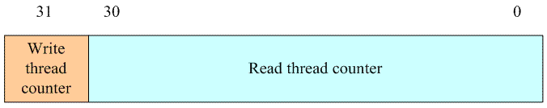

# RW自旋锁

文章来源：http://www.wowotech.net/kernel_synchronization/rw-spinlock.html

## 一、为何会有rw spin lock？

在有了强大的spin lock之后，为何还会有rw spin lock呢？无他，仅仅是为了增加内核的并发，从而增加性能而已。spin lock严格的限制只有一个thread可以进入临界区，但是实际中，有些对共享资源的访问可以严格区分读和写的，这时候，其实多个读的thread进入临界区是OK的，使用spin lock则限制一个读thread进入，从而导致性能的下降。

本文主要描述RW spin lock的工作原理及其实现。需要说明的是[自旋锁](4-自旋锁.md)是本文的基础，请先阅读该文档以便保证阅读的畅顺。

## 二、工作原理

### 应用举例

我们来看一个rw spinlock在文件系统中的例子：
```c
static struct file_system_type *file_systems;
static DEFINE_RWLOCK(file_systems_lock);
```

linux内核支持多种文件系统类型，例如EXT4，YAFFS2等，每种文件系统都用`struct file_system_type`来表示。内核中所有支持的文件系统用一个链表来管理，`file_systems`指向这个链表的第一个node。访问这个链表的时候，需要用`file_systems_lock`来保护，场景包括：

1. `register_filesystem`和`unregister_filesystem`分别用来向系统注册和注销一个文件系统。

2. `fs_index`或者`fs_name`等函数会遍历该链表，找到对应的`struct file_system_type`的名字或者index。

这些操作可以分成两类，第一类就是需要对链表进行更新的动作，例如向链表中增加一个file system type*（注册）*或者减少一个*（注销）*。另外一类就是仅仅对链表进行遍历的操作，并不修改链表的内容。在不修改链表的内容的前提下，多个thread进入这个临界区是OK的，都能返回正确的结果。但是对于第一类操作则不然，这样的更新链表的操作是排他的，只能是同时有一个thread在临界区中。

### 基本的策略

使用普通的spin lock可以完成上一节中描述的临界区的保护，但是，由于spin lock的特性就是只允许一个thread进入，因此这时候就禁止了多个读thread进入临界区，而实际上多个读thread可以同时进入的，但现在也只能是不停的spin，cpu强大的运算能力无法发挥出来，如果使用不断retry检查spin lock的状态的话*（而不是使用类似ARM上的WFE这样的指令）*，对系统的功耗也是影响很大的。因此，必须有新的策略来应对：

lock的逻辑：

- 假设临界区内没有任何的thread，这时候任何read thread或者write thread可以进入，但是只能是其一。

- 假设临界区内有一个read thread，这时候新来的read thread可以任意进入，但是write thread不可以进入

- 假设临界区内有一个write thread，这时候任何的read thread或者write thread都不可以进入

- 假设临界区内有一个或者多个read thread，write thread当然不可以进入临界区，但是该write thread也无法阻止后续read thread的进入，他要一直等到临界区一个read thread也没有的时候，才可以进入，多么可怜的write thread。

unlock的逻辑如下：

- 在唯一的write thread离开临界区的时候执行unlock操作，释放掉锁，那些处于spin的各个thread*（read或者write）*可以竞争上岗。

- 在read thread离开临界区unlock的时候，需要根据情况来决定是否让其他处于spin的write thread们参与竞争。
  - 如果临界区仍然有read thread，那么write thread还是需要spin*（这时候read thread可以进入临界区，听起来也是不公平的）*
  - 如果所有的read thread都已经unlock，这时候write thread们可以参与到临界区的竞争中，如果获取到锁，那么该write thread可以进入。

## 三、实现

### 文件整理

rw spin lock的头文件的结构和spin lock是一样的。include/linux/rwlock_types.h文件中定义了通用rw spin lock的基本的数据结构*（例如`rwlock_t`）*和如何初始化的接口*（`DEFINE_RWLOCK`）*。include/linux/rwlock.h。这个头文件定义了通用rw spin lock的接口函数声明，例如`read_lock`、`write_lock`、`read_unlock`、`write_unlock`等。include/linux/rwlock_api_smp.h文件定义了SMP上的rw spin lock模块的接口声明。

需要特别说明的是：用户不需要include上面的头文件，基本上普通spinlock和rw spinlock使用统一的头文件接口，用户只需要include一个include/linux/spinlock.h文件就OK了。

### 数据结构

`rwlock_t`数据结构定义如下：

```c
typedef struct {
    arch_rwlock_t raw_lock;
} rwlock_t;
```
`rwlock_t`依赖arch对rw spinlock相关的定义。

### 接口API

我们整理RW spinlock的接口API如下表：

| 接口API描述                                                  | rw spinlock API                                    |
| ------------------------------------------------------------ | -------------------------------------------------- |
| 定义rw spin lock并初始化                                     | `DEFINE_RWLOCK`                                    |
| 动态初始化rw spin lock                                       | `rwlock_init`                                      |
| 获取指定的rw spin lock                                       | `read_lock` `write_lock`                           |
| 获取指定的rw spin lock同时disable本CPU中断                   | `read_lock_irq` `write_lock_irq`                   |
| 保存本CPU当前的irq状态，disable本CPU中断并获取指定的rw spin lock | `read_lock_irqsave` `write_lock_irqsave`           |
| 获取指定的rw spin lock同时disable本CPU的bottom half          | `read_lock_bh` `write_lock_bh`                     |
| 释放指定的spin lock                                          | `read_unlock` `write_unlock`                       |
| 释放指定的rw spin lock同时enable本CPU中断                    | `read_unlock_irq` `write_unlock_irq`               |
| 释放指定的rw spin lock同时恢复本CPU的中断状态                | `read_unlock_irqrestore` `write_unlock_irqrestore` |
| 获取指定的rw spin lock同时enable本CPU的bottom half           | `read_unlock_bh` `write_unlock_bh`                 |
| 尝试去获取rw spin lock，如果失败，不会spin，而是返回非零值   | `read_trylock write_trylock`                       |

在具体的实现中，如何将archtecture independent的代码转到具体平台的代码的思路是和spin lock一样的，这里不再赘述。

### ARM平台的细节

对于arm平台，rw spin lock的代码位于arch/arm/include/asm/spinlock.h和spinlock_type.h *（其实普通spin lock的代码也是在这两个文件中）* ，和通用代码类似，spinlock_type.h定义ARM相关的rw spin lock定义以及初始化相关的宏；spinlock.h中包括了各种具体的实现。我们先看`arch_rwlock_t`的定义：
```c
typedef struct {
    u32 lock;
} arch_rwlock_t;
```
毫无压力，就是一个32-bit的整数。从定义就可以看出rw spinlock不是ticket-based spin lock。我们再看看`arch_write_lock`的实现：

```c
static inline void arch_write_lock(arch_rwlock_t *rw)
{
    unsigned long tmp;

    prefetchw(&rw->lock);  // 知道后面需要访问这个内存，先通知hw进行preloading cache
    __asm__ __volatile__(
        "1:ldrex  %0, [%1]\n"  // 获取lock的值并保存在tmp中
        "teq  %0, #0\n"  // 判断是否等于0
        WFE("ne")   // 如果tmp不等于0，那么说明有read 或者write的thread持有锁，那么还是静静的等待吧。其他thread会在unlock的时候Send Event来唤醒该CPU的
        "strexeq  %0, %2, [%1]\n"  // 如果tmp等于0，给lock赋值0x80000000，对于有符号数来说就是负数，后面的分析中会用到这个值
        "teq  %0, #0\n"  // 是否str成功，如果有其他thread在上面的过程插入进来就会失败
        "bne  1b"   // 如果不成功，那么需要重新来过，否则持有锁，进入临界区
        : "=&r" (tmp)
        : "r" (&rw->lock), "r" (0x80000000)
        : "cc");

    smp_mb();  // memory barrier的操作
}
```

对于write lock，只要临界区有一个thread进行读或者写的操作 *（具体判断是针对32bit的lock进行，覆盖了writer和reader thread）* ，该thread都会进入spin状态。如果临界区没有任何的读写thread，那么writer进入临界区，并设定lock＝0x80000000。需要注意的是，`strexeq  %0, %2, [%1]`中用了带eq条件的strex，这是由于wfe休眠中的cpu可由下面两种情况唤醒：

- 各种其他非sev的信号

- 持有其他spinlock *（不是这个函数参数中的那个spin lock的其他spin lock）* 的线程unlock时广播sev信号

这两种情况下应继续wfe休眠，但是实际上却唤醒了，所以strex要带上eq条件，避免本次循环中在没拿到锁的情况下给lock赋值。这样会继续执行下去，在`bne 1b`的时候再次循环。注意到实际上采用的是带ne条件的`wfene`指令，如果这次拿到锁了那么就不会进行wfe休眠，直接跳过这句后因为满足eq条件，也就执行了`strexeq`命令。实现上面这个逻辑的代码很精简，非常nb。

我们再来看看write unlock的操作：

```c
static inline void arch_write_unlock(arch_rwlock_t *rw)
{
    smp_mb();  // memory barrier的操作

    __asm__ __volatile__(
    "str  %1, [%0]\n"  // 恢复0值
    :
    : "r" (&rw->lock), "r" (0)
    : "cc");

    dsb_sev();  // memory barrier的操作加上send event，wakeup其他 thread（那些cpu处于WFE状态）
}
```

write unlock看起来很简单，就是一个lock＝0x0的操作。了解了write相关的操作后，我们再来看看read的操作：

```c
static inline void arch_read_lock(arch_rwlock_t *rw)
{
    unsigned long tmp, tmp2;

    prefetchw(&rw->lock);
    __asm__ __volatile__(
    "1:  ldrex  %0, [%2]\n"  // 获取lock的值并保存在tmp中
    "  adds  %0, %0, #1\n"  // tmp = tmp + 1
    "  strexpl  %1, %0, [%2]\n"  // 如果tmp结果非负值，那么就执行该指令，将tmp值存入lock
    WFE("mi")  // 这里判断如果tmp是负值，说明有write thread，那么就进入wait for event状态
    "  rsbpls  %0, %1, #0\n"  // 判断strexpl指令是否成功执行，注意这里的ls条件和arch_write_lock中的分析类似
    "  bmi  1b"  // 如果不成功，那么需要重新来过，否则持有锁，进入临界区
    : "=&r" (tmp), "=&r" (tmp2)
    : "r" (&rw->lock)
    : "cc");

    smp_mb();
}
```

上面的代码比较简单，需要说明的是`adds`指令更新了状态寄存器 *（指令中s那个字符就是这个意思）* ，`strexpl`会根据`adds`指令的执行结果来判断是否执行。还记得前面write lock会存入0x80000000，将其理解为有符号数就是-2147483648。所以这里用正负条件来判断是否有write lock。pl的意思就是positive or zero，也就是说，如果结果是正数或者0 *（没有thread在临界区或者临界区内有若干read thread）* ，该指令都会执行，如果是负数 *（有write thread在临界区）* ，那么就不执行。OK，最后我们来看read unlock的函数：

```c
static inline void arch_read_unlock(arch_rwlock_t *rw)
{
    unsigned long tmp, tmp2;

    smp_mb();

    prefetchw(&rw->lock);
    __asm__ __volatile__(
    "1:  ldrex  %0, [%2]\n"  // 获取lock的值并保存在tmp中
    "  sub  %0, %0, #1\n"  // tmp = tmp - 1
    "  strex  %1, %0, [%2]\n"  // 将tmp值存入lock中
    "  teq  %1, #0\n"  // 是否str成功，如果有其他thread在上面的过程插入进来就会失败
    "  bne  1b"  // 如果不成功，那么需要重新来过，否则离开临界区
    : "=&r" (tmp), "=&r" (tmp2)
    : "r" (&rw->lock)
    : "cc");

    if (tmp == 0)
    dsb_sev();  // 如果read thread已经等于0，说明是最后一个离开临界区的reader，那么调用sev去唤醒WFE的cpu core
}
```

最后，总结一下：



32个bit的lock，0～30的bit用来记录进入临界区的read thread的数目，第31个bit用来记录write thread的数目，由于只允许一个write thread进入临界区，因此1个bit就OK了。在这样的设计下，read thread的数目最大就是2的30次幂减去1的数值，超过这个数值就溢出了，当然这个数值在目前的系统中已经足够的大了，姑且认为它是安全的吧。

 

## 四、后记

read/write spinlock对于read thread和write thread采用相同的优先级，read thread必须等待write thread完成离开临界区才可以进入，而write thread需要等到所有的read thread完成操作离开临界区才能进入。正如我们前面所说，这看起来对write thread有些不公平，但这就是read/write spinlock的特点。此外，在内核中，已经不鼓励对read/write spinlock的使用了，RCU是更好的选择。如何解决read/write spinlock优先级问题？RCU又是什么呢？我们下回分解。