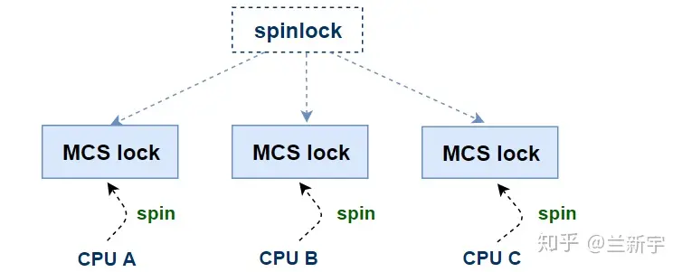
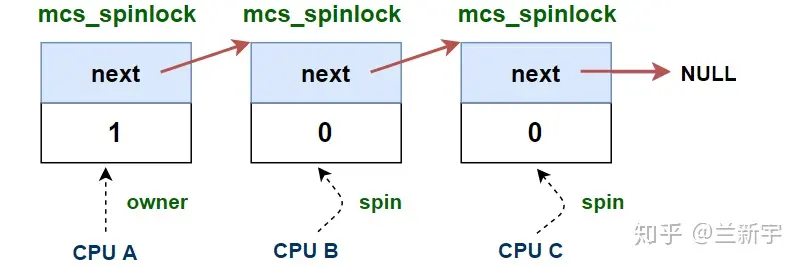
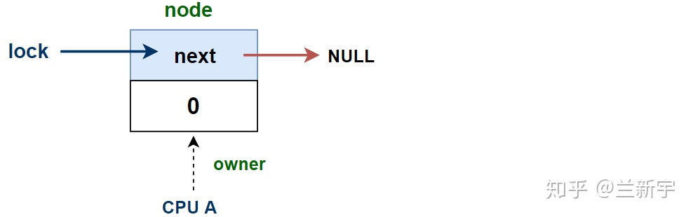
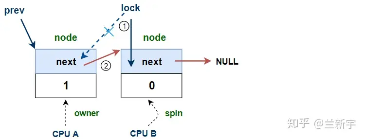
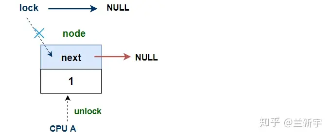
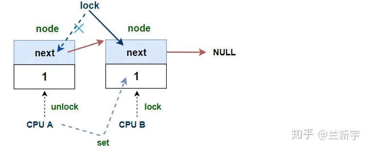
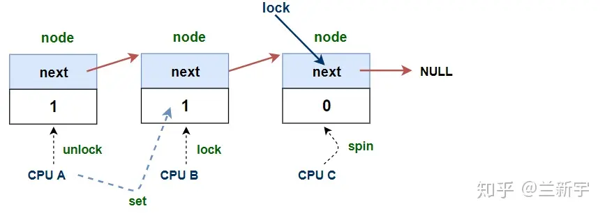
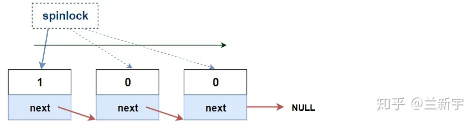

# MCS自旋锁

文章来源：https://zhuanlan.zhihu.com/p/89058726

## 一、前言

每当一个spinlock的值出现变化时，所有试图获取这个spinlock的CPU都需要读取内存，刷新自己对应的cache line，而最终只有一个CPU可以获得锁，也只有它的刷新才是有意义的。锁的争抢越激烈 *（试图获取锁的CPU数目越多）*，无谓的开销也就越大 *（cache-line bouncing）* 。既然只有一个CPU能获得锁，那就精准的把锁给这个CPU，而不打扰其他没机会获得锁的CPU。

- 怎么知道哪个CPU能获得锁呢？让CPU按调用lock函数的顺序排队，排到的那个能获得锁
- 传递锁？上一个释放锁的CPU对一个共享变量进行一次原子赋值。队列中即将获得锁的CPU读到了这次赋值，就能进入临界段了

终极问题：

这不还是要修改共享变量吗，怎么解决cache-line bouncing？之前提到的Per-CPU变量用武之地来了。别急，我们马上来看看究竟是怎么施法的

## 二、工作原理

如果在spinlock的基础上进行一定的修改，让每个CPU不再是等待同一个spinlock变量，而是基于各自不同的Per-CPU的变量进行等待，那么每个CPU平时**只需要查询自己对应的这个变量所在的本地cache line**，仅在这个变量发生变化的时候，才需要读取内存和刷新这条cache line，这样就可以解决上述的这个问题。

要实现类似这样的spinlock的分身，其中的一种方法就是使用mcs lock。想要获取一个spinlock的每个CPU，都会建立一份自己的mcs lock。这个mcs lock数据结构在内核中定义为`mcs_spinlock`结构体，其中有一个成员标记了是否获得了锁。



### 加锁

每当一个CPU想要获取一个spinlock，它就会将自己的mcs lock加到一个所有CPU共享的等待队列 *（共享的队列为什么不会造成ache-line bouncing，后面再解释）* 的队尾，成为该队列的一个新节点。排队的设计也意味着mcs是公平的锁。

### 解锁

释放一个spinlock的过程是怎样的呢？释放的线程找到队列中的下一个线程 *（后面用线程A表示）*，这个线程A目前还在spin。然后要释放锁的线程把自己出队。前面提过线程A有一个成员指示了是否获得锁，现在修改这个成员的值，告诉它拿到锁了。线程A就会进入临界段了。刚才操作的这个成员，是专属于线程A所在的CPU的。因为只有这个CPU要读取它，所以修改它的值并不会引起一众CPU刷新自己的缓存。无关的那些CPU们看到属于自己的标记没有被修改，仍旧保持spin。

前面提到，共享的队列为什么不会造成ache-line bouncing？CPU们只管读属于自己的那个标记，至于加锁解锁的时候的入队和出队，其他CPU根本不理会，他们只是在被动等待自己的标志发生改变，自然就不会刷新缓存。

在我们继续之前，提一下mcs锁的命名，mcs是发明人的名字的缩写，也就是John Mellor-Crummey和Michael Scott，所以MCS三个字母不涉及这个锁本身具体的意义

## 三、接口API

不要惊讶，即使在5.15内核的*kernel/locking/mcs_spinlock.h* 中也只有两个方法和一个结构体

| 接口API描述      | rw spinlock API       |
| ---------------- | --------------------- |
| 结构体本体       | `struct mcs_spinlock` |
| 获取mcs spinlock | `mcs_spin_lock`       |
| 释放mcs spinlock | `mcs_spin_unlock`     |

MCS lock的实现保留在了Linux的代码中，但是你却找不到任何一个地方调用了它的lock和unlock的函数。

因为相比起Linux中只占4个字节的ticket spinlock，MCS lock多了一个指针，要多占4（或者8）个字节，消耗的存储空间是原来的2-3倍。spinlock可是操作系统中使用非常广泛的数据结构，这多占的存储空间不可小视，而且spinlock常常会被嵌入到结构体中。

所以，真正在Linux中使用的，是在mcs spinlock的基础上进行了改进的qspinlock。研究mcs spinlock的意义，不光是理解qspinlock的必经之路，从代码的角度，可以看出其极致精炼的设计，绝没有任何多余的步骤，值得玩味。

## 四、实现

### 数据结构

```c
struct mcs_spinlock {
    struct mcs_spinlock *next;
    int locked; /* 1 if lock acquired */
    int count;  /* nesting count, see qspinlock.c */
};
```

### 实现细节

我们先来看看，当一个CPU试图获取锁的时候会发生什么。它将自己的`mcs_spinlock`对象加到一个各个CPU共享的的等待队列中，成为该队列的一个节点，加入的方式是由该队列末尾节点的`next`成员指向这个新的节点。

`locked`的值为1表示该CPU是当前的持有者，为0则表示没有持有。



唯一需要说明的是`smp_wmb`这个用于SMP场合下的写内存屏障，它确保了编译器以及CPU都不会打乱sequence counter内存访问以及临界区内存访问的顺序 *（临界区的保护是依赖sequence counter的值，因此不能打乱其顺序）* 。

对于一个锁的实现来说，最核心的操作无非就是加锁和解锁。先来看下MCS lock的加锁过程是怎样的：

```c
static inline
void mcs_spin_lock(struct mcs_spinlock **lock, struct mcs_spinlock *node)
{
	struct mcs_spinlock *prev;
	// 初始化node
	node->locked = 0;
	node->next   = NULL;
    // 找队列末尾的那个mcs lock
	prev = xchg(lock, node);
	if (likely(prev == NULL)) {
		// 队列为空，立即获得锁
		return;
	}
    // 队列不为空，把自己加到队列的末尾
	WRITE_ONCE(prev->next, node);
	// 等待lock的持有者把lock传给自己
	arch_mcs_spin_lock_contended(&node->locked);
}
```

前面说过，加入队列的方式是添加到末尾，所以首先需要知道这个末尾在哪里。函数的第一个参数`lock`就是指向这个末尾的指针，之所以是二级指针，是因为末尾节点可能不存在，那么指向末尾节点的指针可以是NULL，而且可以在函数内修改指向末尾节点的指针。

第二个参数"node"是试图加锁的CPU对应的MCS lock节点。

`xchg()`的名称来源于x86的指令，其实现可简化表示成这样：

```c
xchg(*ptr, x)
{
	ret = *ptr;
	*ptr = x;
	return ret;
}
```

它干了两件事，一是给一个指针赋值，二是获取了这个指针在赋值前的值。

对应着上面的这个`mcs_spin_lock()`，通过`xchg()`获得的`prev`就是`*lock`最初的值。如果这个值为NULL，说明队列为空，当前没有其他CPU持有这个spinlock，那么试图获取这个spinlock的CPU可以成功获得锁。同时，`xchg()`还让lock指向了这个持有锁的CPU的node。



这里用了`likely()`，意思是在大部分情况下，队列都是空的，说明现实的应用场景中，争抢通常不会太激烈。

前面说过，`locked`的值为1表示持有锁，可此刻CPU获取锁之后，竟然没有把自己node的`locked`值设为1？这是因为在队列为空的情况，CPU可以立即获得锁，不需要基于`locked`的值进行spin，所以此时`locked`的值是1还是0，根本就无所谓。除非是在debug的时候，需要查看当前持有锁的CPU，否则绝不多留一丝赘肉。

如果队列不为空，那么就需要把自己这个`node`加入等待队列的末尾。



具体的等待过程是调用`arch_mcs_spin_lock_contended()`，它等待的，或者说spin的，是自己MCS lock里的value的值，直到这个值变为1。而将这个值设为1，是由它所在队列的前面那个node，在释放的时候完成的。

```c
#define arch_mcs_spin_lock_contended(l)					\
do {									\
	smp_cond_load_acquire(l, VAL);					\
} while (0)
#endif
```

我们再来看看怎么解锁

```c
void mcs_spin_unlock(struct mcs_spinlock **lock, struct mcs_spinlock *node)
{
    // 找到等待队列中的下一个节点
    struct mcs_spinlock *next = READ_ONCE(node->next);

    // 当前没有其他CPU试图获得锁
    if (likely(!next)) {
        // 直接释放锁 
        if (likely(cmpxchg_release(lock, node, NULL) == node))
        	return;
        // 等待新的node添加成功
        while (!(next = READ_ONCE(node->next)))
        	cpu_relax();
    }
    // 将锁传给等待队列中的下一个node
    arch_mcs_spin_unlock_contended(&next->locked);
}
```

两个参数的含义同`mcs_spin_lock()`类似，`lock`代表队尾指针，`node`是准备释放锁的CPU在队列中的mcs spinlock节点。

大概率还是没有锁的争抢，`next`为空，说明准备释放锁的CPU已经是该队列里的最后一个，也是唯一一个CPU了，那么很简单，直接将`lock`设为NULL就可以了。

`cmpxchg_release()`中的release代表这里包含了一个memory barrier。如果不考虑这个memory barrier，那么它的实现可简化表示成这样：

```c
cmpxchg(*ptr, old, new)
{
	ret = *ptr;
	if (*ptr == old)
		*ptr = new;
	return ret;
}
```

跟前面讲到的`xchg()`差不多，也是先获取传入指针的值并作为函数的返回值，区别是多了一个compare。结合`mcs_spin_unlock()`来看，就是如果`*lock == node`，那么`*lock = NULL`。



如果`*lock != node`，说明当前队列中有等待获取锁的CPU……等一下，这不是和前面的代码路径相矛盾吗？其实不然，两个原因：

距离函数开头获得`next`指针的值已经过去一段时间了。
回顾前面加锁的过程，新的node加入是先让`*lock`指向自己，再让前面一个node的`next`指向自己。
所以，在这个时间间隔里，可能又有CPU把自己添加到队列里来了。于是，待新的node添加成功后，才可以通过`arch_mcs_spin_unlock_contended()`将spinlock传给下一个CPU。

```c
#define arch_mcs_spin_unlock_contended(l)				\
	smp_store_release((l), 1)
```

传递spinlock的方式，就是将下一个node的`locked`值设为1。



如果在释放锁的一开始，等待队列就不为空，则`lock`指针不需要移动：



可以看到，无论哪种情况，在解锁的整个过程中，持有锁的这个CPU既没有将自己node中的`locked`设为0，也没有将`next`设为NULL，好像清理工作做的不完整？

事实上，这已经完全无所谓了，当它像击鼓传花一样把spinlock交到下一个node手里，它就等同于从这个spinlock的等待队列中移除了。多一事不如少一事，少2个无谓的步骤，效率又可以提升不少。

所以，分身之后的spinlock在哪里？它就在每个mcs spinlock的`locked`域里，像波浪一样地向前推动着。`locked`的值为1的那个node，才是spinlock的真身。




## 五、参考文献

- [MCS locks and qspinlocks [LWN.net\]](https://lwn.net/Articles/590243/)
