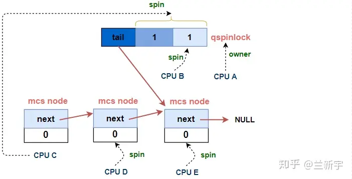
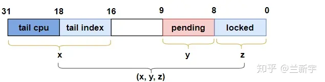
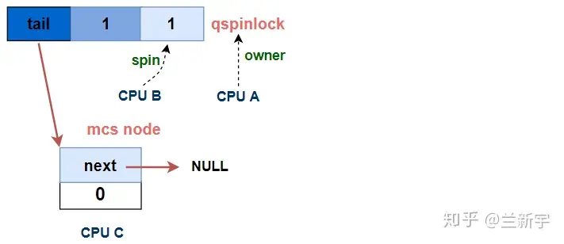
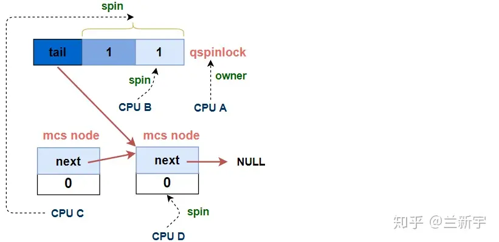

# q自旋锁

文章来源：https://zhuanlan.zhihu.com/p/100546935

## 一、前言

q自旋锁这个翻译不是官方说法，大多数地方叫它队列自旋锁。总之，英文是qspinlock，全称queued spinlock。它是linux中spinlock的默认实现。看了下文件注释，它是hp、redhat、intel写的。

mcs spinlock可以解决在锁的争用比较激烈的场景下的cache line刷新问题，但它内含一个指针，所以更消耗存储空间，但这个指针又是不可或缺的，因为正是依靠这个指针，持有mcs spinlock的CPU才能找到等待队列中的下一个节点，将mcs spinlock传递给它。本文要介绍的qspinlock，其首要目标就是把原生的mcs spinlock结构体进行改进，塞进4字节的空间里。

## 二、原理

一个qspinlock就是结构体`qspinlock`的一个实例，是各个CPU共享的，由于linux中`qspinlock`是spinlock的正真实现，所以它被typedef成了`arch_spinlock_t`，有三个成员：（`tail`，`pending`，`locked`），这三个成员常常是用这样的三元组表达的，默认值都为0。CPUA、CPUB、CPUC、...、CPUn、... 都要竞争这个锁的时候，会排队。已经拿到锁CPUA的会把`locked`设为1，表示它占了这个皇位。排在后面的那个CPUB会把`pending`设为1，表示它占了太子位。

但是再排在后面的CPU阿哥们，也就是从CPUC开始，就不配进入皇宫 *（`qspinlock`的正式成员）*。它们和mcs spinlock一样组成一个队列，最后进入队列的CPU会负责把自己的信息记录到`tail`成员里。注意只有16个bit的`tail`不是个指针，它是什么一会再说。从CPUC开始，就会拥有一个Per CPU的`qnode` *(皇宫外自己建house)*，它有三个成员`next`、`locked`、`count`。对，它就是`mcs_spinlock`，这就是为啥现在内核里还保留了mcs spinlock。

内核里有大量spinlock，创建一个spinlock如果就要用一个mcs spinlock的话，占用空间太大。而用qspinlock，只需要一个4字节的`qspinlock`。要知道，一个锁只有两个CPU竞争甚至完全没有竞争是很正常的，这种情况下就不会创建队列，要到3个CPU同时竞争时才会相当于mcs spinlock。

回到正题，到CPUE也在等待时，就会是这样的:



绿色的spin指的是每个CPU退出spin的依据。

CPUB作为太子，在等皇帝CPUA把`locked`设为0。CPUC既要等太子，也要等皇帝。排在CPUC后面的CPU和mcs spinlock一样，等着自己的`locked`被修改。释放锁流程如下：

1. CPUA释放锁就只要把`qspinlock`的`locked`设为0
2. CPUB发现后退出spin，把`pending`设为0，`locked`再次设为1。CPUB释放锁就把`locked`设为0
3. CPUC等到了就直接当皇帝 *（CPUC所为太子的弟弟不会再次成为太子，不然辈分不对）*，原因是没有必要反复操作`pending`，多做无用的操作。CPUC设置`qspinlock`的`locked`为1后还会把CPUD自己的qnode的`locked`设为1，告诉CPUD准备当下一任皇帝。CPUC释放锁就只要把`qspinlock`的`locked`设为0
4. CPUD发现CPUC释放了锁，和CPUC一样，直接当皇帝。同时把CPUE的qnode的`locked`设为1。CPUD释放锁就只要把`qspinlock`的`locked`设为0
5. 终于轮到CPUE了，它也是直接当皇帝，但是它没有下一任了，所以会把`tail`设为0。PUE释放锁就只要把`qspinlock`的`locked`设为0

总结一下：CPUA、CPUB、CPUC、CPUE的驾崩操作完全一致，但登基操作各不相同。所以官方的说法中qspinlock有4种状态

- CPUA想上锁时没有竞争 - uncontended
- CPUB想上锁时需要等待，但不用排到队列里 - pending
- CPUC想上锁时需要等待，而且要排到队列里，但可以作为队首 - uncontended queue
- CPUD想上锁时需要等待，而且要排到队列里，而且只能作为队尾 - contended queue
- CPUE同CPUD - contended queue

回收上一个问题：`tail`是什么？linux中有4种上下文，线程、硬中断、软中断、不可屏蔽的中断，为了在各个上下文中都能自由使用spinlock，其实qnode有4份，形成数组`qnodes[]`。16位的`tail`分两段，2位的`tail[2:0]`为上下文索引，所以`qnodes[tail & 0x03]`就是要找的的那个qnode。另一段`tail[16:3]`是CPU编号，用来找到Per CPU的`qnodes`，也就是

```c
qnode* node = 
    per_cpu_ptr(&qnodes[tail & 0x03], tail >> 3);
```

## 三、数据结构

等待队列是由一个qspinlock和若干个mcs lock节点组成的，或者说由一个qspinlock加上一个mcs node的队列组成，其中mcs node的队列和上文描述的那个队列基本是一样的，所以我们重点先来看下这个qspinlock是如何构成的

*include/asm-generic/qspinlock_types.h*，5.15内核，小端

```c
typedef struct qspinlock {
	union {
		atomic_t val;
		struct {
			u8	locked;
			u8	pending;
		};
		struct {
			u16	locked_pending;
			u16	tail;
		};
	};
} arch_spinlock_t;
```

qspinlock对mcs做了优化，通过存储tail而不是存储节点的地址把大小压缩成32bit，这32bit分成4个字段。如果处理器采用的是little endian，那么它们的内存排布关系如下图所示（左边为高、右边为低）：


`val`作为一个32位的变量，包含了三个部分：`locked byte`, `pending`和`tail`，`tail`又细分为`tail index`和`tail cpu`，因此布局是这样的：

- val[7:0] `locked byte `

  是否持有锁的`locked`只需要表示0和1两个值，在qspinlock中被压缩成了8个bits

- val[8] `pending`

- val[15:9] 没用

- val[17:16] `tail index`

  有一个Per CPU的数组用来记录mcs node的内存位置，`tail index`用作数组索引 *（后面解释）*

- val[31:18] `tail cpu` (+1)

  是末尾 mcs node的CPU编号加1，即，来记录等待队列tail的位置 *（加1的原因后面解释）*

我们来看看qspinlock队列节点是怎么定义的 *(5.15内核kernel/locking/qspinlock.c)*:

```c
struct qnode {
	struct mcs_spinlock mcs;
};
DEFINE_PER_CPU_ALIGNED(struct qnode, qnodes[MAX_NODES]);
```

其实就是个`mcs_spinlock`。前面提到，tail index是一个Per CPU数组的索引，这个数组是这么定义的：

```c
static DEFINE_PER_CPU_ALIGNED(struct qnode, qnodes[MAX_NODES]);
```

其中，`MAX_NODES`是4，因为linux中一共有4种context，分别是task, softirq, hardirq和nmi，而一个CPU在一种context下，至多试图获取一个spinlock *（后面会细说）*，因而一个CPU至多同时试图获取4个spinlock，`tail index`就是用来标识context的编号的。为此，`mcs_spinlock`结构体中增加了一个`count`成员来记录嵌套次数。定义如下*(5.15内核kernel/locking/mcs_spinlock.h)*:

```c
struct mcs_spinlock {
	struct mcs_spinlock *next;
	int locked;
	int count;
};
```


以上说的两点是qspinlock在MCS lock已有元素的基础上进行的改进，相比于MCS lock，qspinlock还新增了一个元素：占据1个bit的`pending`，它的作用将随着本文叙述的推进，慢慢揭晓。

## 四、实现

为了方便演示，我们把一个`val`对应的`locked`, `pending`和`tail`作为一个三元组(x,y,z)来表示：



### 获取锁

**第一个**CPU获取锁时，三元组的初始值是(0, 0, 0)，当第一个CPU试图获取锁时，可以立即成为该spinlock的owner，此时三元组的值变为(0, 0, 1)


对应的代码实现是`queued_spin_lock()`的前半部分 *（5.15内核include/asm-generic/qspinlock.h）*

```c
static __always_inline void queued_spin_lock(struct qspinlock *lock)
{
	int val = 0;
	if (likely(atomic_try_cmpxchg_acquire(&lock->val, &val, _Q_LOCKED_VAL)))
		return;
	queued_spin_lock_slowpath(lock, val);
}
```

`atomic_try_cmpxchg_acquire`将要上锁的`lock`的`val`与0比较，如果为0，获得lock，并将待上锁`lock`的`val`设为1 *(`_Q_LOCKED_VAL`)*

**第二个**CPUB打算上锁的时候，第一个CPUA还没释放，所以CPUB需要等待，其获取锁的过程被称为slow path。对，就是上面那个`queued_spin_lock_slowpath`。在slowpath中，由于CPUA的存在，CPUB需要等待，所以设置`pending`位，然后开始spin。

我们关注源码中的第二个CPU试图获取spinlock部分*（5.15内核简化后kernel/locking/qspinlock.c）*

```c
#define _Q_LOCKED_OFFSET     0
#define _Q_LOCKED_BITS	     8
#define _Q_LOCKED_MASK       ((1U << _Q_LOCKED_BITS) - 1) << _Q_LOCKED__OFFSET // (*,*,1)

// val是在queued_spin_lock中获取的当前lock的值
void queued_spin_lock_slowpath(struct qspinlock *lock, u32 val)
{
// part 2 - 第三个CPU试图获取spinlock
    ...
    goto queue; // 跳转到part 3
    ...
 
// part 1 - 第二个CPU试图获取spinlock
    // 设置pending位 (0,0,1)->(0,1,1)     (tail, pending, lock)
    val = queued_fetch_set_pending_acquire(lock);

    // 等待第一个CPU移交
    if (val & _Q_LOCKED_MASK)    
        atomic_cond_read_acquire(&lock->val, !(VAL & _Q_LOCKED_MASK));

    // 第二个CPU成功获取spinlock (0,1,0)->(0,0,1) (tail, pending, lock)
    clear_pending_set_locked(lock);
    return;

// part 3 - 进入MCS lock队列
queue:
    ...

// part 4 - 第三个CPU成功获取spinlock
locked:
    ...
}
```


这CPUB可被视作是该spinlock的第一顺位继承人：`locked`相当于是皇宫，而`pending`相当于是东宫，CPUB就是太子，设置`pending`为1就相当于入主东宫，等待着继承大统。

皇帝大行之后*（第一个CPU释放spinlock）*，皇位暂时空缺，三元组的的值变为(0, 1, 0)。之后，曾经的太子离开居住的东宫 *（将`pending`置0）*，进入皇宫，成为其新的主人 *（将`locked`置1）*。这一过程对应的函数实现就是`clear_pending_set_locked()`。

**第三个**CPUC来获取锁时，运行上面注释中 *第三个CPU试图获取spinlock* 的路径如下

```c
#define _Q_PENDING_OFFSET    8
#define _Q_PENDING_VAL       (1U << _Q_PENDING_OFFSET) // (0,1,0)

// part 2A
    // (0,1,0)是spinlock移交的过渡状态
    if (val == _Q_PENDING_VAL) {
        // 等待移交完成 (0,1,0) -> (0,0,1)  (tail, pending, lock)
        int cnt = 1
        val = atomic_cond_read_relaxed(&lock->val, (VAL != _Q_PENDING_VAL)|| !cnt--);
    }

// part 2B
    // 已经有2个及以上的CPU持有或试图获取spinlock
    if (val & ~_Q_LOCKED_MASK)
        goto queue;  // 进入队列
```

此时，要分par2A和part2B两种情况：

- 如果CPUB还在等待，那么CPUC就成了第二顺位继承人，皇宫只有一个，东宫也只有一个，对于第二顺位继承人的王子来说，只能先去宫城外面自建府邸了。对应代码的实现就是part 2B的`goto queue`

- 但前面提到，三元组的值为（0, 1, 0）时 *（`pending`=1）*，是一个政权移交的过渡状态，此时CPUB即将成为spinlock新的持有者，那么作为CPUC，也即将递进成为第一顺位继承人，所以如果遇到了这个特殊时期，CPUC会选择使用`atomic_cond_read_relaxed()`函数，先稍微等一会儿，即part 2A。如果在它第二次读取`lock->val`的值时，已经不再是(0, 1, 0)，说明移交已完成，变成了(0, 0, 1)，那么它将绕过part 2B，执行part 1的代码（也就是CPUB走过的路）。

我们来细说part2B，(0, 1, 0)的状态毕竟是特例，大部分情况下，还是会`goto queue`，对应代码part 3。

```c
queue:
// part 3A
    struct mcs_spinlock *node = this_cpu_ptr(&qnodes[0].mcs);
    int idx = node->count++;
    node += idx;
    node->locked = 0;
    node->next = NULL;
//part 3B
    u32 tail = encode_tail(smp_processor_id(), idx);
    // (p,1,1) -> (n,1,1)  (tail, pending, lock)
    u32 old = xchg_tail(lock, tail);
```

首先是从前面提到的Per CPU的`qnodes[]`数组中获取对应的node，并初始化这个node，其中`idx`就是表示context编号的`tail index`。然后是调用`encode_tail()`将自己的CPU编号和context编号存进`tail`里，并通过`xchg_tail()`让qspinlock *（即`lock`）* 的`tail`指向自己。前面提到，`tail CPU`是CPU的编号加1，因为对于编号为0，`tail index`也为0的CPU，如果不加1，那么算出来的`tail`值就是0，而`tail`为0表示当前没有队列。



`old`变量的用途？CPUC是基于哪个变量spin的呢？由于按照代码顺序行文，这要在下面解释。那代码为什么是这样的顺序呢？还是在下面解释。

**第n个**CPUn试图获取锁。上面的`xchg_tail()`除了在qspinlock中设置新的`tail`值，还返回了qspinlock中之前存储的tail值，即`old`。对于第n个 *（n > 3）* 试图获取spinlock的CPU，之前的`tail`值是指向上一个node的，获得上一个node的目的是让它的`next`指向自己，这样才能加入等待队列。

```c
struct mcs_spinlock *prev, *next, *node;

// part 3C
// 如果队列不为空 - 第N个CPU
if (old & _Q_TAIL_MASK) {
    // 解析tail值，获取上一个MCS node
    prev = decode_tail(old);

    // 让上一个node指向自己，加入等待队列
    WRITE_ONCE(prev->next, node);  // prev->next = node

    // 基于自己的locked值进行spin
    arch_mcs_spin_lock_contended(&node->locked);
}

//part 3D
#define _Q_LOCKED_PENDING_MASK (_Q_LOCKED_MASK | _Q_PENDING_MASK)
// 自己是队列的第一个节点 - 第二顺位继承
val = atomic_cond_read_acquire(&lock->val, !(VAL & _Q_LOCKED_PENDING_MASK));
```

加入队列后，CPUn会基于自己node的`locked`进行spin，这就和mcs spinlock一样了。

回收上面的问题：CPUC是基于哪个变量spin的呢？part 3D中的这个`atomic_cond_read_acquire()`函数，在本文已经是第二次出现了，上一次是在part 1里，所不同的是，part 1里是第二个CPU  *（第一顺位继承人，CPU B）* 基于代表皇帝的`locked`进行spin，而这里是第三个CPU *（第二顺位继承人，CPU C）* 基于代表皇帝的`locked `以及代表太子的`pending`进行spin。



也就是说，当太子继承到皇位后，如果第二顺位继承人还在队列里，那它并不会马上变成太子 *（要不然辈分不对）*，而是要等到太子也释放了spinlock，`locked`和`pending`都为0时，直接获取spinlock。

part 3D是放在CPUn试图获取spinlock的代码位置之后的，说明CPUn在解除基于自己node的`locked`的spin之后，也会执行这段代码，原因在接下来介绍完part 4的代码之后，将会自然地浮出水面。

经过等待，**CPUC成功获取锁**。当qspinlock的`locked`和`pending`都变为0时，CPUC总算熬出头了，它终于可以结束spin，获取这个spinlock。

```c
// part 4
locked:
    // 唯一node, 直接获取锁 (n,0,0) -> (0,0,1)    (tail, pending, lock)
    if (((val & _Q_TAIL_MASK) == tail) &&
        atomic_try_cmpxchg_relaxed(&lock->val, &val, _Q_LOCKED_VAL))
        goto release;

    // 如果队列中还有其他node (n,0,0) -> (n,0,1)    (tail, pending, lock)
    set_locked(lock);

    // 解除下一个node在队列中的spin
    arch_mcs_spin_unlock_contended(&node->next->locked);

release:
    __this_cpu_dec(mcs_nodes[0].count);
```

如果qspinlock的`tail`是指向自己的，说明它是当前`MCS node`队列中唯一的node，那么直接通过`atomic_try_cmpxchg_relaxed()`获取spinlock即可，三元组的值变为(0, 0, 1)。

如果不是，说明队列中还有其他的node在等待，那么按照上文描述的队列的规则，需要调用`arch_mcs_spin_unlock_contended()`函数，设置下一个node *（CPUD）* 的`locked`为1。在这里，`locked`为1只是结束了在队列中的的spin，意味着CPUD在前面part 3C中的等待就结束了，它将基于`locked`和`pending`来spin，即part 3C *（和之前的CPUC一样）*。可见，对于CPUn来说，从它加入等待队列，到最终成功获取spinlock，其spin基于的对象并不是从一而终的，在到达队首之前都是基于自己的node进行spin，到达队首后则是基于qspinlock进行spin。

### 释放锁

相比起加锁，解锁的过程看起来简直简单地不像话：

```c
void queued_spin_unlock(struct qspinlock *lock)
{
    smp_store_release(&lock->locked, 0);
}
```

只需要把的`locked`置为0就可以了。这也不难理解，后面一直有CPU盯着呢，一旦皇位空缺，马上就有人补齐，只需要乖乖地把位子腾出来就行。

### 总结

这是5.15内核，kernel/locking/qspinlock.c中对上锁流程的注释

```c
(queue tail, pending bit, lock value)

             fast     :    slow                                  :    unlock
                      :                                          :
uncontended  (0,0,0) -:--> (0,0,1) ------------------------------:--> (*,*,0)
                      :       | ^--------.------.             /  :
                      :       v           \      \            |  :
pending               :    (0,1,1) +--> (0,1,0)   \           |  :
                      :       | ^--'              |           |  :
                      :       v                   |           |  :
uncontended           :    (n,x,y) +--> (n,0,0) --'           |  :
  queue               :       | ^--'                          |  :
                      :       v                               |  :
contended             :    (*,x,y) +--> (*,0,0) ---> (*,0,1) -'  :
  queue               :         ^--'                             :

```

回过头来看一下qspinlock：如果只有1个或2个CPU试图获取锁，那么只需要一个4字节的qspinlock就可以了，其所占内存的大小和ticket spinlock一样。当有n个CPU试图获取锁，需要一个qspinlock加上(n-2)个qnode。

对于设计合理的spinlock，在大多数情况下，锁的争抢都不应该太激烈，最大概率是只有1个CPU试图获得锁，其次是2个，并依次递减。

这也是qspinlock中加入`pending`的意义，如果是两个CPU试图获取锁，那么第二个CPU只需要简单地设置`pending`为1，而不用另起炉灶创建一个qnode。这是除了体积减小外，qspinlock相较于mcs spilock所做的第二层优化。

试图加锁的CPU数目超过3个是小概率事件，但一旦发生，使用ticket spinlock机制就会造成多个CPU的cache line无谓刷新的问题，而qspinlock可以利用MCS node队列来解决这个问题。

可见，使用qspinlock机制来实现spinlock，具有很好的可扩展性，也就是无论当前锁的争抢程度如何，性能都可以得到保证。所以在linux中，如果针对某个处理器架构的代码没有单独定义，**qspinlock将是spinlock默认的实现方式**。

```go
#define arch_spin_lock(l)    queued_spin_lock(l)
```

作为SMP系统中的一个高频操作，spinlock的性能毫无疑问会影响到整个系统运行的性能，所以，从ticket spinlock到mcs spinlock，再到qspinlock，见证了内核开发者对其一步步的优化历程。在优秀的性能背后，是对每一行代码的反复推敲和考量，最终铸就了qspinlock精妙但并不简单的实现过程。也许，它还有优化的空间……

## 五、接口API

和spinlock是一样的，见[自旋锁](./synchronization/4-自旋锁.md)

